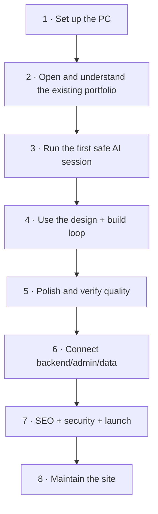

# mmoptibuilds Portfolio Setup

> **Start here. Do not read this repository like a book.**
>
> Follow the tracks in order. Each track tells you exactly **which tool to open,
> which model to use, what files/context to give it, what prompt to paste, what
> you check yourself, and what gets handed to the next tool**.

## You are here



### Do this now

**If this PC is not fully set up:**  
→ [Track 1 — First-time setup](tracks/01-first-time-setup.md)

**If Git, Node, Antigravity and Claude Code already work:**  
→ [Track 2 — Open and understand the project](tracks/02-open-and-understand-project.md)

> [!IMPORTANT]
> The portfolio already has a strong engineering foundation. **Do not rebuild it
> from scratch.** Preserve the admin panel, enquiry flow, verification suite,
> typed content, SEO foundations, responsive behavior and accessibility work.
> Improve the design and business effectiveness on top of that foundation.

## Your normal workspace

Keep one local clone of the portfolio open like this:

```text
GitHub Desktop
└── mmoptibuilds-portfolio-yin-yang
    └── shows branch / changes / commits / push / pull

Antigravity Project
└── SAME local portfolio folder
    ├── Editor
    ├── Terminal A → npm run dev
    ├── Terminal B → claude
    └── Browser/agent → visual QA

Gemini App
└── browser/app only
    └── receives curated files + plans + screenshots, not your whole machine

OpenCode
└── later, Terminal C in SAME repo
    └── support/review/docs tasks only unless explicitly promoted
```

> [!CAUTION]
> **One writer at a time.** Do not let Claude/DeepSeek, Antigravity and OpenCode
> all edit the same working tree simultaneously.

## The one workflow to remember

```mermaid
flowchart LR
    A["GLM-5.3<br/>plan"] --> B["Gemini 3.1 Pro<br/>critique"]
    B --> C["GLM-5.3<br/>reconcile"]
    C --> D["DeepSeek V4 Flash<br/>implement"]
    D --> E["targeted checks + npm run verify"]
    E --> F["GLM-5.3<br/>code review"]
    F --> G["DeepSeek<br/>fix"]
    G --> H["Antigravity + Gemini<br/>visual/browser QA"]
    H --> I["DeepSeek<br/>visual fix"]
    I --> J["verify + docs + commit + handoff"]
```



You **do not run every box for a typo**. Use the full loop for meaningful
features, redesigns, architecture changes and milestone reviews.

## How prompts work in this guide

Every important AI step uses this exact pattern:

1. **Open** — the tool and local project location.
2. **Use** — the model/role.
3. **Give it** — the exact files, screenshots, diff or previous output it needs.
4. **Paste this prompt** — copy it exactly, then replace only clearly marked
   task text.
5. **What you check yourself** — a short human check before trusting the answer.
6. **Pass to the next tool** — the exact part of the answer to copy forward.

The separate `prompts/` folder is only a quick-reference library. **The tracks
contain the prompts in the order you actually use them.**

## Four site goals

| Area | Main job |
|---|---|
| `/` | Memorable, portfolio-like, Awwwards-level experience **without hiding Studio or Systems** |
| `/studio` | Show credible work/capability and convert website clients |
| `/systems` | Explain requirement-led hardware sourcing clearly and convert enquiries |
| `/admin` | Let the owner work quickly and safely; no decorative complexity |

Performance and accessibility are floors. An impressive effect that makes the
site slow, unreadable, keyboard-hostile or confusing is a failed effect.

## Rules that prevent most disasters

1. **One writer at a time** on the main working tree.
2. Before meaningful changes, **pull first** and make a branch.
3. Never paste API keys, customer enquiry data or production secrets into an AI chat.
4. Never invent clients, testimonials, awards, prices, stock or performance claims.
5. Run `npm run verify` before calling meaningful code work finished.
6. Opus and Sol are optional bonuses. The plan must work without them.
7. GSAP, Lenis, WebGL, shaders and large frame sequences are **conditional tools**, not default ingredients.
8. End every meaningful work session with a concise docs/handoff update.
9. When you do not understand a term, use the [plain-English glossary](reference/glossary.md).

## Progress

- [ ] Track 1 — First-time setup
- [ ] Track 2 — Open and understand the project
- [ ] Track 3 — First safe agent session
- [ ] Track 4 — Design and build loop
- [ ] Track 5 — Quality and polish
- [ ] Track 6 — Backend, admin and data
- [ ] Track 7 — SEO, security and launch
- [ ] Track 8 — Maintenance

<details>
<summary><strong>I need a reference, not the next track</strong></summary>

- [Git + GitHub Desktop](reference/git-and-github-desktop.md)
- [Claude Code](reference/claude-code.md)
- [Antigravity](reference/antigravity.md)
- [Models + routing](reference/models-and-routing.md)
- [OpenCode + OmniRoute](reference/opencode-and-omniroute.md)
- [UI, motion + skills](reference/ui-motion-and-skills.md)
- [Playwright + Context7](reference/playwright-and-context7.md)
- [Subagents, MCP + hooks](reference/subagents-mcp-and-hooks.md)
- [Project source of truth](reference/project-source-of-truth.md)
- [Supabase, backend + admin](reference/supabase-backend-and-admin.md)
- [Cloudflare, hosting + domain](reference/hosting-cloudflare-and-domain.md)
- [Security + Strix](reference/security-and-strix.md)
- [Troubleshooting](reference/troubleshooting.md)
- [Glossary](reference/glossary.md)

</details>

## Current project commands

The portfolio currently requires Node.js 22 or newer and already provides:

```powershell
npm run dev
npm run build
npm run lint
npm run typecheck
npm run test
npm run check:a11y
npm run check:keyboard
npm run check:responsive
npm run check:bundle
npm run check:perf
npm run verify
npm run cf:build
npm run cf:preview
npm run cf:deploy
```

`npm run verify` is the main project gate.

**Guide last reviewed:** 2026-09-02  
**Portfolio repository:** `mmoptibuilds-commits/mmoptibuilds-portfolio-yin-yang`
