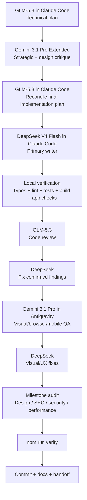
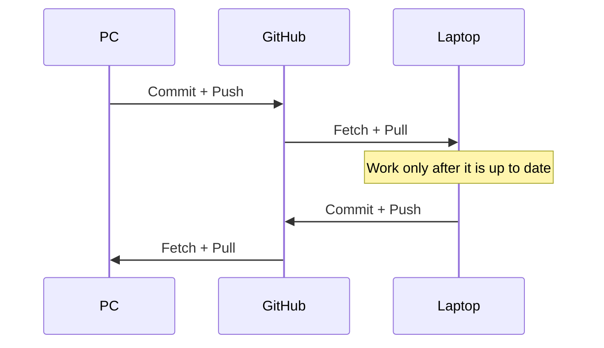

# Portfolio Setup Guide — Design Specification

**Status:** Approved architecture + expanded beginner-guide requirements  
**Date:** 2026-09-02  
**Primary user:** Mohammed Miran / mmoptibuilds  
**Guide repository:** `mmoptibuilds-commits/portfolio-setup`  
**Portfolio repository:** `mmoptibuilds-commits/mmoptibuilds-portfolio-yin-yang`  
**Production domain:** `mmoptibuilds.com`

---

## 1. Purpose

This repository will become the single practical operating guide used to finish, improve, test, deploy, and maintain the mmoptibuilds portfolio/business site.

It is **not a programming textbook** and must not feel like one.

The guide is for a user who can prompt AI tools but does not yet know Git, branches, worktrees, CLI conventions, backend/database concepts, deployment, hosting, MCP, hooks, subagents, or the meaning of most slash commands.

The guide must therefore answer, for every important task:

1. **What am I doing?**
2. **Why am I doing it?**
3. **Where do I do it?**
4. **Which tool/model do I use?**
5. **What exactly do I type or paste?**
6. **What should I expect to happen?**
7. **How do I know it worked?**
8. **What do I do if it fails?**
9. **What is the next step?**

The desired end state is a portfolio/business site that is:

- distinctive and Awwwards-level in art direction where appropriate;
- portfolio-like and memorable on the main `/` experience;
- conversion-focused and goal-clear on `/studio` and `/systems`;
- fast, responsive, mobile-optimized, accessible, SEO-ready, and maintainable;
- supported by a working owner/admin flow and enquiry infrastructure;
- honest about proof, projects, clients, metrics, awards, and capabilities;
- usable both as a business website and as evidence of the user’s ability for employment/recruiting.

Priority order when goals conflict:

1. Distinctive art direction / credibility
2. Conversion and clear communication
3. Performance
4. Accessibility
5. Maintainability and scalability

Rule: goals 3 and 4 are floors, not expendable luxuries. A visual effect that materially harms performance or accessibility fails the design.

---

## 2. Existing Portfolio Strategy

The current Yin-Yang repository is **not to be rebuilt from scratch**.

Preserve the engineering foundation and improve it aggressively where the improvement serves the approved design/business goals.

Preserve and improve:

- working admin panel;
- enquiry pipeline;
- responsive and accessibility infrastructure;
- verification suite;
- typed content architecture;
- SEO infrastructure;
- current route structure unless research gives a concrete reason to change it;
- honest content/proof policy;
- separate Studio and Systems identities inside one codebase.

Visual freedom:

- keep the Yin-Yang duality concept;
- substantially improve execution;
- permit GSAP, Lenis, WebGL/Three.js, shaders, custom interaction, frame sequences, and other advanced techniques **only when they materially improve the approved experience and survive verification**;
- Studio and Systems must remain easy to find and enter even if the homepage is experimental.

Experience modes:

| Route | Experience mode | Primary job |
|---|---|---|
| `/` | Portfolio / Experience | Memorable brand + personal credibility + clear paths to Studio and Systems |
| `/studio` | Experience + Persuade | Demonstrate work and convert website clients |
| `/systems` | Persuade | Explain sourcing/services clearly and convert hardware enquiries |
| `/admin` | Operate | Fast, clear, secure owner workflow; no unnecessary art direction |

---

## 3. The Guide Must Be Action-First, Not Book-First

The previous manuals failed because they exposed too much information at once.

This guide must use **progressive disclosure**.

The root `README.md` is a dashboard, not a table of contents dump.

The first screen should answer:

> **What do I do right now?**

Example shape:

```text
YOU ARE HERE
    │
    ▼
[1] Install the required base tools
    │
    ▼
[2] Clone/open the portfolio
    │
    ▼
[3] Make Claude Code work in Antigravity
    │
    ▼
[4] Run the first project health check
    │
    ▼
[5] Start the first GLM planning task
```

Advanced topics such as Strix, SEO, deployment, worktrees, GSAP, Lenis, MCP, and subagents must appear **just in time**, not on day one.

The guide may contain many reference files, but the user should rarely need to decide which file to read next. Every page ends with a clear **NEXT** link.

---

## 4. GitHub Markdown Visual System

Use GitHub-native features heavily so the guide is easy to scan and understand.

### Required visual techniques

- Mermaid flowcharts for workflows and architecture.
- Mermaid sequence diagrams for PC ↔ GitHub ↔ laptop and agent handoffs.
- Tables for model/tool comparisons.
- GitHub alerts (`NOTE`, `TIP`, `IMPORTANT`, `WARNING`, `CAUTION`) for critical information.
- `<details>` / `<summary>` sections to hide advanced explanations and troubleshooting until needed.
- Task lists for setup progress.
- Syntax-highlighted PowerShell, JSON, Markdown, and shell blocks.
- Screenshots/GIFs when the UI step is difficult to communicate with text alone.
- Small custom SVG/PNG diagrams may be committed under `assets/guide/` when Mermaid is insufficient.
- ASCII diagrams only when they are clearer than Mermaid.

### Important constraint

GitHub Markdown does not execute arbitrary Python/JavaScript/HTML applications inside a README. Python/HTML may be used **to generate images/assets**, which are then committed and displayed in Markdown. Interactive HTML should not be a dependency of the guide.

### Standard task-card pattern

Every practical task should follow a repeatable pattern:

```markdown
## Task: Open the portfolio in Antigravity

**Goal:** ...

**Use:** Antigravity IDE

**Where:** Windows PC → Antigravity

### Do this
1. ...
2. ...

### Copy this
```powershell
...
```

### What you should see
...

### If it fails
<details>
<summary>Show fixes</summary>
...
</details>

### Done when
- [ ] ...

### Next
→ ...
```

This template should make the guide predictable even when the underlying subject is complicated.

---

## 5. Source-of-Truth System for Agents

`roadmap.mmoptibuilds.com` is useful but is **not sufficient as the only source of truth**.

Reasons:

- not every harness/session will have browser access;
- web content can change independently of the Git commit being edited;
- agents need local instructions before they decide whether to browse;
- external-site context is slower and easier to omit;
- PC and laptop agents must receive the same durable project state.

The portfolio repository should eventually contain a compact committed source-of-truth layer:

```text
README.md
AGENTS.md
CLAUDE.md
DESIGN.md
CHANGELOG.md

docs/
├── PROJECT-BRIEF.md
├── PROJECT-STATE.md
├── ROADMAP.md
├── ARCHITECTURE.md
├── DECISIONS.md
├── WORKFLOW.md
├── TESTING.md
├── DEPLOYMENT.md
└── agent-log/
    └── YYYY-MM.md
```

### Responsibilities

**README.md**  
Human quick start: what the repo is, how to run it, how to verify it.

**AGENTS.md**  
Always-important agent rules and codebase traps. Concise; no giant handbook.

**CLAUDE.md**  
Claude-specific durable instructions that cannot be derived reliably from code.

**DESIGN.md**  
Approved art direction, design modes, motion principles, typography, accessibility/performance floors, anti-template rules, and when advanced effects are justified.

**PROJECT-BRIEF.md**  
Short authoritative statement of mmoptibuilds, Studio, Systems, audience, business model, what may/may not be claimed, portfolio/employment objective, domain, and success criteria.

**PROJECT-STATE.md**  
Current factual state: what works, what is incomplete, known issues, current milestone, next recommended task.

**ROADMAP.md**  
Committed roadmap snapshot/summary. `roadmap.mmoptibuilds.com` may be linked as the human visual companion, but agents should not need it for basic decisions.

**ARCHITECTURE.md**  
Frontend/backend/database/admin/enquiry/deployment architecture explained both technically and in beginner language.

**DECISIONS.md**  
Important decisions with date, reason, rejected alternatives, and whether the decision may be revisited.

**WORKFLOW.md**  
Exact GLM → Gemini → GLM → DeepSeek → GLM → Antigravity workflow.

**CHANGELOG.md**  
User-visible and meaningful engineering changes, not every trivial edit.

**agent-log/YYYY-MM.md**  
Chronological session handoffs.

### Agent-session log format

Every meaningful session records:

```text
Time: IST + UTC
Machine: PC / laptop
Harness: Claude Code / Antigravity / OpenCode
Model: ...
Role: planner / writer / reviewer / visual QA / support
Task: ...
Files changed: ...
Commands/tests run: ...
Result: ...
Known issues: ...
Next action: ...
Commit: SHA or not committed
```

Documentation updates must be proportional. A typo does not require five files to change.

---

## 6. Primary Agent Architecture

Approved pipeline:



### Model roles

**GLM-5.3**
- planning;
- architecture;
- difficult debugging;
- finalizing Gemini design suggestions into code-safe plans;
- code review;
- isolated emergency implementation when DeepSeek repeatedly fails or the task is exceptionally sensitive.

**Gemini 3.1 Pro Extended (Gemini app)**
- plan critique;
- design strategy;
- multimodal/reference analysis;
- large-context synthesis;
- recruiter/business/customer perspective.

**DeepSeek V4 Flash (Claude Code)**
- default implementation;
- refactors;
- tests;
- fixes;
- executing approved plans;
- updating documentation after implementation.

**Gemini 3.1 Pro (Antigravity)**
- browser-driven visual review;
- responsive/mobile review;
- interaction review;
- accessibility/UX visual inspection;
- screenshot/reference comparison;
- browser verification.

**OpenCode + OmniRoute**
- Markdown/docs;
- small isolated tasks;
- cheap independent reviews;
- research summaries;
- test ideas;
- tasks where a free model is genuinely strong.

Opus and Sol are bonuses only and are never dependencies.

---

## 7. Permissions and Autonomy

The user wants minimal interruptions.

### Recommended local-machine preset: Fast Autonomy

Use high autonomy **inside the repo** with explicit guardrails.

Claude Code:
- prefer `auto` mode or carefully configured allow rules;
- allow reads, normal repo edits, local verification, `git status`, `git diff`, `git log`, and approved package scripts;
- protect secrets and dangerous Git/filesystem operations;
- ask/block for destructive operations, force pushes, broad deletion, secret access, unreviewed deployments, and risky database writes.

Antigravity:
- `Always Proceed` for terminal command execution when working in the trusted project;
- keep non-workspace file access disabled/denied unless a task explicitly needs it;
- use project permissions/deny rules for dangerous commands.

OpenCode:
- role-specific agents with explicit permissions;
- docs/reviewer agents should not get unrestricted application editing.

### Full Claude `bypassPermissions`

The guide will include this because the user explicitly wants to understand/use it, but it is **not the default on the host Windows installation**.

Official Claude Code guidance says bypass mode may write protected paths including `.git` and `.claude` and should only be used in an isolated VM/container.

The guide will therefore present:

1. **Recommended:** local `auto`/allowlist setup — almost no prompts.
2. **Advanced:** `bypassPermissions` only in an isolated environment/snapshot/worktree where machine-wide damage is constrained.

Never hide the risk merely to reduce clicks.

---

## 8. Commands: Teach Only What Is Useful, but Teach It Completely

The guide must not dump every command alphabetically. Commands are grouped by **when the user needs them**.

### Claude Code — high-frequency commands

Must teach with custom mmoptibuilds examples:

- `/doctor` — installation/configuration health.
- `/status` and `/usage` if available in installed version/provider configuration.
- `/plan` — read-only plan before a substantial change.
- `/goal` — keep working across turns until a **clear measurable condition** is true.
- `/loop` — repeat a prompt while the session stays open; best for monitoring/rechecking, not vague design iteration.
- `/run` — launch/drive app.
- `/verify` — verify the running result.
- `/run-skill-generator` — teach `/run` and `/verify` the project recipe once when necessary.
- `/diff` — inspect changes.
- `/code-review` / `/review` — explicit diff/PR review.
- `/security-review` — code-change security review.
- `/debug` — diagnose runtime/Claude environment issues.
- `/context` — see context-window pressure.
- `/compact` — compress a long conversation.
- `/clear` — new clean task/session.
- `/resume` — return to a prior session.
- `/rewind` — roll conversation/code back to a checkpoint.
- `/permissions` — inspect/change permissions.
- `/mcp` — inspect MCP status when MCP is actually configured.
- `/btw` — quick side question without polluting the main thread.
- `/subtask` / explicit subagents — isolated side work.
- `/batch` — rare, only for clearly independent repo-scale units using worktrees.
- `/agents` / @-mention agent — identify/use custom subagents.

#### `/goal` rule

Good:

```text
/goal Continue until npm run verify passes, the homepage has no horizontal overflow at the required breakpoints, and all issues introduced by this task are fixed.
```

Bad:

```text
/goal Make the site world class.
```

The second has no measurable stop condition.

#### `/loop` rule

Good:

```text
/loop 5m Check whether the deployment completed. If it failed, summarize the failure. Do not modify code.
```

Good:

```text
/loop 10m Re-run the external availability check and report only if status changes.
```

Bad:

```text
/loop Improve the homepage forever.
```

Use `/loop` for repeated checks/maintenance while the session stays open, not as the normal implementation loop.

### Antigravity — high-value commands

Teach:

- `/goal` — autonomous bounded completion.
- `/plan` — implementation-plan artifact before edits.
- `/grill-me` — interview user/requirements before ambiguous design/architecture work.
- `/browser` — explicit browser subagent for live UI/research/visual QA.
- `/boost` — paid deep multi-agent reasoning for genuinely hard bugs/refactors, not ordinary work.
- `/teamwork-preview` — rare repo-scale/multi-day campaigns; generally not needed for normal portfolio iteration.
- `/learn` — save repeated corrections/patterns into rules/skills.
- `/btw` — background aside.
- `/schedule` — scheduled maintenance/checks, not normal feature work.
- `/permissions` — autonomy level/security controls.
- `/agents` — monitor/manage subagents in CLI where applicable.
- `/resume`, `/rewind`, `/rename` — session housekeeping.

Antigravity does **not** need a Claude-style `/loop` in the primary workflow; `/schedule` and `/goal` cover different automation needs.

### OpenCode — beginner-use commands

Teach:

- `/connect` — connect OmniRoute/provider.
- `/models` — select/check available models.
- `/init` — create/update `AGENTS.md` only when appropriate; do not blindly overwrite the curated project instructions.
- `/compact` — reduce session context.
- `/new` — clean session.
- `/sessions` — resume/switch.
- `/undo` / `/redo` — session + file rollback.
- `/help` — command reference.
- `@file` — explicitly attach a file to context.
- `!command` — run a shell command and attach output when safe/needed.

Create custom project commands such as:

- `/docs-update`
- `/review-md`
- `/handoff`
- `/review-diff`
- `/small-task`

Each custom command should select the intended agent/model/prompt when OpenCode supports it.

---

## 9. Subagents: Simple Rules

Subagents are useful when they **save main-context space or isolate independent work**.

Use them for:

- running large test suites and returning only failures;
- codebase reconnaissance;
- documentation research;
- reviewing a diff independently;
- searching for accessibility/performance issues;
- parallel research where workers do not edit overlapping files.

Do not use them simply because the feature exists.

### Main-repo writing rule

One writer at a time.

If parallel agents must write, use isolated worktrees and assign non-overlapping responsibilities.

### Claude Code

Teach both:

```text
Use the code-reviewer subagent to inspect the current diff. Do not edit files.
```

and explicit @-mention of configured agents.

### Antigravity

Use built-in asynchronous subagents primarily for browser/research/testing work. Use `/boost` only for difficult reasoning and `/teamwork-preview` only for genuinely large independent tracks.

### OpenCode

Create narrow agents such as:

- `docs` — edit Markdown only;
- `review` — read-only review;
- `small-task` — limited source edit scope;
- `research` — web/reference work.

---

## 10. Skills Strategy

Do **not** install every skill into every harness.

### Core project skills

- custom `mmoptibuilds-project` skill;
- Impeccable;
- Vercel React Best Practices;
- Vercel Web Interface Guidelines;
- Playwright CLI skill.

### Conditional skills

- Scroll Craft — premium scroll storytelling/homepage/Studio where justified;
- Emil Kowalski motion skills — motion creation/review;
- Taste Skill — creative second opinion when work feels generic/AI-generated;
- Checklist Design — milestone visual audit;
- GSAP Skills — only after GSAP is approved for a concrete sequence;
- Claude SEO — late-stage SEO audit/implementation;
- Strix — security milestone;
- img2threejs — only if a 3D reconstruction task is approved.

### Optional/later

- Hermes Agent — maintenance/research/orchestration after launch or for a demonstrated repetitive workflow;
- OpenDesign experiments — only if it solves a specific design problem better than the core stack.

### Skip initially

- Headroom — credits are not the bottleneck;
- Image2Code — multimodal Gemini/Antigravity is sufficient for the current workflow;
- duplicate design frameworks that overlap with the curated core.

---

## 11. MCP Strategy

MCP is not a checklist of things to install.

Start with **no mandatory MCP server** unless a task proves it is needed.

Prefer:

- native repo/file tools;
- Context7 CLI/skill for current library documentation;
- Playwright CLI/skill for browser testing;
- built-in Antigravity browser capabilities.

Add an MCP only when it provides live context/actions that are otherwise awkward or impossible.

Potential later examples:

- Supabase MCP — schema/database inspection, ideally read-only for review tasks;
- GitHub MCP — only if in-harness GitHub operations become materially useful;
- Cloudflare MCP/tooling — deployment/log/zone work if native CLI is insufficient;
- Sentry MCP — only after Sentry exists;
- Figma/Mobbin — only if the design workflow uses those sources.

The guide must explain:

- what MCP is in plain English;
- how to install it in Claude, Antigravity, and OpenCode;
- how to verify connection;
- when **not** to install it;
- permission risk;
- how to remove/disable it.

---

## 12. Hooks and Automation

Hooks should enforce deterministic rules, not create an AI bureaucracy.

### Claude Code hooks

Useful events:

- SessionStart: display project state / reminder of source-of-truth files;
- PreToolUse: block destructive commands/secrets;
- PostToolUse: optionally run narrow formatting/lint checks after relevant edits;
- Stop / TaskCompleted: ensure verification and handoff rules for meaningful work.

### Antigravity hooks

Use only where they provide equivalent deterministic guardrails/automation.

### Documentation enforcement

Do not block a trivial typo because CHANGELOG was not updated.

Meaningful implementation should end with:

1. verification;
2. relevant docs update;
3. agent-log entry;
4. diff review;
5. commit/handoff.

---

## 13. Free Models and OmniRoute

OmniRoute is used **only for the support/free-model path**.

Do not route:

- Claude Code → AgentRouter through OmniRoute;
- Antigravity through OmniRoute;
- Gemini app through OmniRoute.

OpenCode → OmniRoute is the intended path.

Initial free providers should be small and deliberate rather than exhaustive. Start with the strongest/reliable providers selected by current research, then add more only if they improve availability or quality.

Free models may do more than documentation **when benchmarking on a real portfolio task proves they excel**. The guide will include a lightweight benchmark procedure rather than assuming every free model is weak.

No random-model roulette during one coding task. Use task-specific pools or explicit model selection.

---

## 14. PC and Laptop Workflow

Use GitHub as the synchronization mechanism for source code.

Human-facing beginner path:



Use GitHub Desktop for the default human workflow.

Teach command-line equivalents for emergencies and for understanding what agents are doing.

Do not Syncthing the Git repository itself.

Syncthing may be used for large raw assets deliberately kept outside Git, such as source renders/videos/PSD/reference frames.

Parallel writing across PC/laptop requires branches/worktrees and is an **advanced optional workflow**, not the day-one path.

---

## 15. Backend, Database, Hosting, and Domain — Beginner Teaching

The guide must assume zero knowledge.

Explain these concepts visually before commands:

```mermaid
flowchart LR
    V[Visitor Browser] --> CF[Cloudflare / mmoptibuilds.com]
    CF --> APP[Next.js application]
    APP --> FORM[Enquiry server action]
    FORM --> DB[(Supabase / local dev store)]
    OWNER[Owner] --> ADMIN[/admin]
    ADMIN --> DB
```

Teach separately:

- domain: the name people type (`mmoptibuilds.com`);
- DNS: points that name to services;
- hosting: computer/service that runs the site;
- frontend: what visitors see/interact with;
- backend: server-side logic;
- database: structured persistent data;
- authentication: proves who may access `/admin`;
- environment variables/secrets: configuration values that must not be committed;
- deployment: producing and publishing the production build.

Preserve the current project’s existing Cloudflare/OpenNext/Supabase-compatible architecture unless a later measured reason justifies migration.

The guide must provide staging → production steps, verification, rollback, and DNS/domain setup in plain English.

---

## 16. Prompt Library Requirements

Every workflow stage gets a copy-paste prompt customized to the harness/model.

Prompt categories include:

- first repo audit;
- GLM technical planning;
- Gemini plan critique;
- GLM plan reconciliation;
- DeepSeek implementation;
- DeepSeek verification;
- GLM code review;
- DeepSeek review-fix;
- Antigravity visual review;
- responsive/mobile review;
- accessibility review;
- animation review;
- performance review;
- homepage art-direction review;
- Studio conversion review;
- Systems conversion review;
- admin usability review;
- SEO audit/fix;
- Strix security workflow;
- deployment preparation;
- documentation/handoff;
- small OpenCode Markdown task;
- free-model independent review;
- debugging escalation;
- failed-build recovery;
- PC ↔ laptop handoff.

When a fixed prompt would be brittle, provide a prompt **template**:

```text
ROLE:
...

CONTEXT TO READ:
...

TASK:
...

DO NOT:
...

SUCCESS CONDITIONS:
...

VERIFY WITH:
...

DOCUMENTATION TO UPDATE:
...
```

The user should not be expected to invent prompt engineering during the build.

---

## 17. Guide Information Architecture

The final repo may contain many reference files, but the user-facing path is milestone-driven.

Proposed top-level experience:

```text
README.md                    START HERE / current next action

tracks/
├── 01-first-time-setup.md
├── 02-open-and-understand-project.md
├── 03-first-safe-agent-session.md
├── 04-design-and-build-loop.md
├── 05-quality-and-polish.md
├── 06-backend-admin-and-data.md
├── 07-seo-security-and-launch.md
└── 08-maintenance.md

reference/
├── claude-code.md
├── antigravity.md
├── opencode.md
├── omniroute.md
├── git-and-github-desktop.md
├── models.md
├── skills.md
├── mcp.md
├── hooks.md
├── subagents.md
├── ui-reference-library.md
├── hosting-and-cloudflare.md
├── supabase.md
└── troubleshooting.md

prompts/
├── planning.md
├── implementation.md
├── review.md
├── visual-qa.md
├── seo.md
├── security.md
└── deployment.md
```

This is preferred over 28 chapters exposed at once.

Reference pages answer “I need to understand X.”

Track pages answer “What do I do next?”

---

## 18. Every Tool Page Must Include

For Claude Code, Antigravity, OpenCode, OmniRoute, GitHub Desktop, Playwright, Context7, Strix, Supabase/Cloudflare tools, and any optional harness accepted later:

1. What it is in one sentence.
2. Why it exists in this workflow.
3. When to use it.
4. When **not** to use it.
5. Installation.
6. Verification command/check.
7. Configuration.
8. Relevant commands only.
9. Relevant skills.
10. Relevant MCP servers, if any.
11. Relevant hooks/permissions.
12. Copy-paste prompts.
13. Example task from this exact portfolio.
14. What successful output looks like.
15. Common failures and fixes.
16. How to stop/undo/rollback.
17. How to update/uninstall.
18. Next step.

---

## 19. Quality Gates for the Guide Itself

The guide is successful only if a beginner can use it without already knowing the terminology.

Before calling the guide complete:

- every required tool has an install test;
- every command is labeled with **where to type it**;
- every dangerous command has a warning and explanation;
- no step assumes knowledge introduced later;
- no page opens with a giant wall of prose;
- advanced sections are collapsed or linked instead of blocking the main path;
- all Mermaid diagrams render on GitHub;
- every track has a clear next step;
- cross-links are valid;
- all prompts identify tool/model/role;
- all provider/model claims that change over time include a `Last verified` date and authoritative link;
- setup is tested on Windows PowerShell first;
- PC/laptop handoff is explicitly tested;
- no secrets/API keys appear in committed examples;
- commands distinguish placeholders from literal values;
- hosting/database concepts are explained visually before deployment commands;
- a user can recover from common Git mistakes without learning advanced Git.

---

## 20. Explicit Non-Goals

This guide will not:

- teach Git internals for their own sake;
- teach JavaScript/React/Next.js as a programming course;
- require understanding every model provider;
- install every UI library;
- install every MCP server;
- make Hermes/OpenDesign/etc. mandatory merely because they exist;
- expose 100 options when one recommended path is sufficient;
- rely on AgentRouter Opus/Sol availability;
- use Syncthing to synchronize `.git`;
- let multiple agents edit the same main working tree simultaneously;
- use unlimited permissions on the host machine without explaining and constraining the risk;
- treat “Awwwards worthy” as permission to destroy usability, accessibility, conversion, or performance.

---

## 21. First Implementation Milestone for the Guide

After this design is approved, implementation should begin with **only the first usable path**, not the whole reference encyclopedia.

Milestone 1:

1. Root `README.md` dashboard / Start Here.
2. `tracks/01-first-time-setup.md`.
3. `tracks/02-open-and-understand-project.md`.
4. Minimal `reference/git-and-github-desktop.md`.
5. Minimal `reference/antigravity.md`.
6. Minimal `reference/claude-code.md`.
7. Initial `prompts/planning.md` and `prompts/implementation.md`.
8. Required diagrams/assets for those steps.
9. Link validation and beginner self-review.

Only after this path is easy to use should the guide expand to OpenCode/OmniRoute, advanced skills/MCP/hooks, backend, SEO, security, and deployment.

This ordering is deliberate: the guide itself must not repeat the “too much at once” failure of the previous manual.
