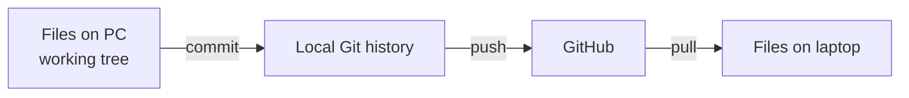
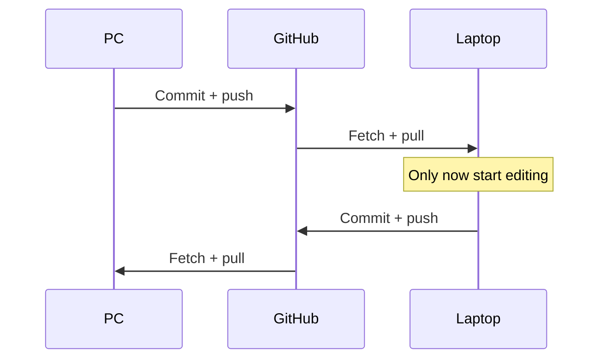

# Git + GitHub Desktop

Use this page when a track tells you to branch, commit, push, pull, undo or work
from another machine.

## The mental model



- **Commit** = save a named checkpoint locally.
- **Push** = upload commits to GitHub.
- **Pull** = download and integrate commits from GitHub.
- **Branch** = a separate line of work.

## Normal human workflow — GitHub Desktop

### Before starting work

**Where:** GitHub Desktop.

1. Select the portfolio repository.
2. Click **Fetch origin**.
3. If it becomes **Pull origin**, click it.
4. Confirm there are no unexpected local changes.
5. Create a branch: **Current branch → New branch**.
6. Name it after the outcome, for example:
   `feat/homepage-art-direction`.

Do not create a branch called `changes`, `test2`, or `final-final`.

### After a meaningful task

1. Inspect every changed file in GitHub Desktop.
2. Make sure no `.env.local`, `.enquiries`, credentials, screenshots with
   customer data, or accidental generated files are included.
3. Enter a useful summary such as:
   `Improve gateway hierarchy and mobile entry paths`
4. Click **Commit to <branch>**.
5. Click **Push origin**.

## Equivalent PowerShell commands

**Where:** PowerShell in the portfolio folder.

Check state:

```powershell
git status
git branch --show-current
```

Get latest main before new work:

```powershell
git switch main
git pull --ff-only
```

Create a feature branch:

```powershell
git switch -c feat/homepage-art-direction
```

Inspect changes:

```powershell
git diff
git status
```

Commit:

```powershell
git add .
git commit -m "Improve gateway hierarchy and mobile entry paths"
git push -u origin HEAD
```

> [!CAUTION]
> `git add .` means “stage everything changed under this folder.” Read
> `git status` first. If a secret file appears, do not stage it.

## PC ↔ laptop rule

Never edit the same branch on both machines at the same time.



For the simple workflow, **finish and push on one machine before moving to the
other**.

## When to use a worktree

A **worktree** is a second folder attached to the same Git repository, usually
for a different branch.

Use one only when two agents genuinely need to write in parallel. Example:

- Agent A: homepage art direction.
- Agent B: isolated SEO metadata audit with separate files.

Do not use parallel worktrees for two agents both changing the homepage.

Antigravity can create a **New Worktree Mode** conversation. Prefer that native
feature over manually inventing folders when Antigravity is coordinating.

## Safe undo ladder

Use the least destructive option that solves the problem.

1. Agent tool undo/rewind, if the bad edit is still in the current session.
2. GitHub Desktop → inspect and discard **specific** uncommitted file changes.
3. `git restore path\to\file` for an uncommitted file you intentionally want to reset.
4. Revert a committed change with a new commit instead of rewriting shared history.

> [!CAUTION]
> Do not use `git reset --hard`, force push, or delete `.git` because an AI told
> you it is “cleaner.” Those commands can destroy work.

Official GitHub Desktop documentation:
<https://docs.github.com/en/desktop>

## Next

Return to the track that linked here.
