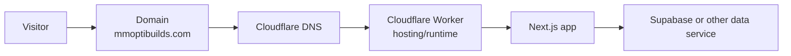

# Cloudflare, hosting + domain

This is the beginner mental model first; commands come after it.

## What happens when someone opens mmoptibuilds.com?



- **Domain:** the name people type.
- **DNS:** records that point that name to services.
- **Hosting/runtime:** the computer/service executing or serving the site.
- **Deployment:** publishing a tested application build to that hosting.

## Current portfolio deployment

The repo is already configured for:

**Next.js → OpenNext → Cloudflare Workers**

Current scripts:

```powershell
npm run cf:build
npm run cf:preview
npm run cf:deploy
```

Do not replace those scripts while doing unrelated design work.

## Current Cloudflare change you should know

**Last verified: 2026-09-02.**

Cloudflare now recommends **vinext** as its default path for **new** Next.js
applications on Workers.

Cloudflare's OpenNext documentation explicitly says to use OpenNext to maintain
an **existing OpenNext application** and migrate when compatibility allows.

Official current docs:

- Next.js on Workers: <https://developers.cloudflare.com/workers/framework-guides/web-apps/nextjs/>
- Existing OpenNext apps: <https://developers.cloudflare.com/workers/framework-guides/web-apps/opennext/>

### What this means for this portfolio

**Do not migrate just because the recommendation changed.**

Finish the portfolio on the working OpenNext path.

Later, a separate branch may run:

```powershell
npx vinext check
```

and evaluate compatibility. A migration is accepted only if it has a concrete
benefit and the full portfolio verification still passes.

## Preview before production

A **preview** lets you test the Worker-like runtime without changing the live
domain.

**Where:** PowerShell, portfolio root.

```powershell
npm run cf:preview
```

Test the important routes and forms against the preview.

## Wrangler login

When deployment work starts:

```powershell
npx wrangler login
```

This opens Cloudflare authentication.

Never put account tokens into Git.

## Secrets

Server secrets belong in the Worker/project secret store.

The current project README uses commands such as:

```powershell
npx wrangler secret put SUPABASE_SECRET_KEY
npx wrangler secret put TURNSTILE_SECRET_KEY
npx wrangler secret put ABUSE_FINGERPRINT_SALT
```

The command will prompt you for the secret. Do not place the secret directly in
the command text or this guide.

`NEXT_PUBLIC_*` values are not secrets—they are intentionally available to the
browser/build—but they still must be correct for the environment.

## DNS and custom domain

Do this from the Cloudflare dashboard only at launch/deployment time:

1. Confirm `mmoptibuilds.com` is in the correct Cloudflare account.
2. Confirm the deployed Worker/project is the correct production target.
3. Attach the custom domain according to the current Workers UI/docs.
4. Confirm HTTPS/TLS is active.
5. Open both root and deep links directly.
6. Confirm canonical URLs use the real production origin.
7. Confirm sitemap/robots are production-correct.

Do not randomly edit DNS records while a working production domain is live.

## Rollback

A **rollback** means returning the application to a known-good deployment.

Before production:

- record the commit SHA being deployed;
- know the previous known-good SHA/deployment;
- make database migrations backward-compatible where possible;
- never assume rolling back code safely reverses a destructive schema change.

If data integrity is uncertain, pausing form acceptance is safer than continuing
unsafe writes.

## Production release order

1. `git status` clean.
2. `npm run verify` passes.
3. Legal/content/truth blockers reviewed.
4. Database migrations reviewed.
5. `npm run cf:preview`.
6. Smoke-test preview.
7. Verify environment variables/secrets.
8. Deploy production deliberately.
9. Smoke-test `/`, `/studio`, `/systems`, `/contact`, `/admin` behavior.
10. Monitor logs and one synthetic form journey.
11. Record release SHA and rollback point.

## Next

Return to [Track 6](../tracks/06-backend-admin-and-data.md) or
[Track 7 — Launch](../tracks/07-seo-security-and-launch.md).
