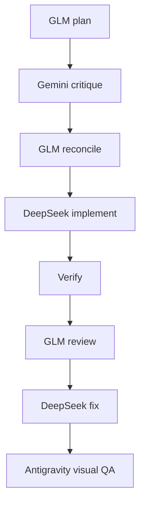

# Models + routing

The model is the reasoning engine. The **harness** is the program around it.

Do not choose models by prestige. Choose the least expensive/reliable model that
is strong at the current job.

## Recommended roles

| Job | Primary choice | Why |
|---|---|---|
| Technical planning / architecture | **GLM-5.3 in Claude Code** | Strong reasoning, good for making an implementation-safe plan |
| Design/strategy critique | **Gemini 3.1 Pro** | Strong multimodal + long-context design/business critique |
| Main implementation | **DeepSeek V4 Flash in Claude Code** | Fast worker for approved code changes |
| Code review / hard debugging | **GLM-5.3** | Independent reasoning after implementation |
| Browser/mobile/visual QA | **Gemini 3.1 Pro in Antigravity** | Can inspect the rendered result and reason visually |
| Cheap support / docs / second opinion | **OpenCode → OmniRoute** | Uses free/support providers without destabilizing primary workflow |

**Opus and Sol:** use only if available and useful. Never delay a milestone waiting
for them.

## Normal feature



## Small mechanical change

Do not run the full pipeline for a two-line copy correction.

```text
DeepSeek → targeted test/check → inspect diff → commit
```

## Hard bug

```text
DeepSeek reproduce → GLM diagnose → DeepSeek minimal fix → targeted test → npm run verify
```

If two disciplined attempts fail, increase context around the evidence. Do not
increase context first.

## Gemini naming

**Last verified: 2026-09-02.** The current official model is **Gemini 3.1 Pro**.
Some product surfaces may expose different reasoning-depth labels. Pick the
stronger reasoning option for the final critique when it is available, but keep
the prompt written for “Gemini 3.1 Pro” rather than depending on a UI label.

Official Gemini model information:
<https://ai.google.dev/gemini-api/docs/models>

## Quota rule

Never design the workflow around an exact quota or reset time unless the
provider currently documents it.

Before a long task:

1. Check the harness/provider status.
2. If the preferred model is unavailable, switch to the closest role-compatible
   model.
3. Do not switch model halfway through one agent's edit unless the task is
   stopped and handed off cleanly.

## Free models

A free model is allowed to code **only after it proves itself on a real isolated
portfolio task**.

Benchmark:

1. Give it the same read-only bug/review task as a trusted model.
2. Compare factual correctness, codebase awareness, hallucinations and useful findings.
3. Give it one small isolated implementation.
4. Run the real tests.
5. Promote it to a specific OmniRoute pool only if it repeatedly passes.

No “100 free models” roulette.

## Context budgets

- **Low:** one task brief + exact files.
- **Medium:** task + relevant architecture/decisions + bounded folder.
- **High:** curated cross-cut for security/architecture/final review.

“High” never means paste the whole chat history.

## Next

For exact tool setup, open [Claude Code](claude-code.md),
[Antigravity](antigravity.md), or [OpenCode + OmniRoute](opencode-and-omniroute.md).
