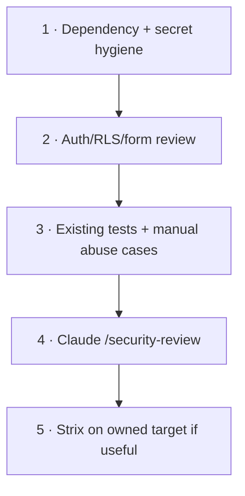

# Security + Strix

Security review should become more invasive only when the previous layer gives
you a reason.

## Review ladder



## 1. Basic checks first

Before a release:

```powershell
npm audit
npm run verify
git status
```

Also inspect:

- `.env*` files are not staged;
- service-role secrets never use `NEXT_PUBLIC_`;
- admin authorization runs server-side;
- production logs do not contain enquiry bodies;
- form validation/rate limiting/Turnstile behavior is preserved;
- dependency additions were intentional.

`npm audit` is a signal. Do not blindly run automated major-version fixes on the
portfolio because one advisory exists.

## 2. Claude security review

Inside Claude Code:

```text
/security-review
```

Then ask for evidence tied to the changed diff and current trust boundaries.

Do not accept generic warnings with no reproduction or affected path.

## 3. Strix — optional milestone tool

**What it is:** an open-source AI security testing agent.

Use it only when:

- you own or are explicitly authorized to test the target;
- the app is in a controlled local/preview environment;
- you understand that active security testing can send unusual/exploit-like requests;
- its model/API configuration fits your existing zero-new-spend resources.

Do **not** run it against random public sites.

Official project:
<https://github.com/usestrix/strix>

### Windows recommendation

Strix's normal install/runtime is more comfortable in Linux/WSL with Docker.
Do not make it part of the day-one native Windows setup.

When you reach the security milestone:

1. Open WSL2.
2. Confirm Docker is available.
3. Install using the **current official Strix instructions**.
4. Point Strix at a local clone or controlled preview.
5. Start with a narrow scope.
6. Review every finding manually.
7. Fix confirmed findings on a normal feature branch.
8. Re-run the portfolio's own verification.

Common current install options include `pipx install strix-agent` or the
project's installer. Re-check the repo before running install commands because
security tooling changes quickly.

## 4. What Strix does not replace

- RLS tests;
- code review;
- dependency/secret review;
- authorization tests;
- privacy/legal review;
- manual business-logic reasoning.

A scan that says “clean” is not a security guarantee.

## 5. Production testing safety

For active tests, prefer:

1. local;
2. isolated preview with synthetic data;
3. production only for explicitly safe smoke checks.

Do not let an agent exfiltrate or retain customer data while “testing.”

## Next

Use the security prompts in
[SEO, security + launch prompts](../prompts/seo-security-launch.md).
