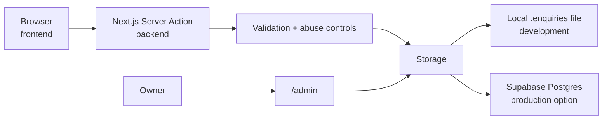

# Supabase, backend + admin

You can run the whole public portfolio locally **without Supabase**. Learn what
the pieces are before connecting production data.

## What each word means



- **Frontend:** browser UI.
- **Backend:** private server-side logic.
- **Database:** structured persistent storage.
- **Authentication:** proves the owner is who they claim to be.
- **Authorization:** proves that signed-in account is actually allowed into owner data.
- **RLS:** Supabase database policies that restrict rows.

## Current development behavior

The portfolio's `lib/enquiry-store.ts` chooses storage from environment
configuration:

- Supabase when required Supabase variables exist.
- Local `.enquiries/enquiries.json` otherwise.

The local file path is git-ignored because it can contain personal data.

That means you can design/test forms and admin locally without creating a fake
database first.

## `.env.local`

An `.env.local` file contains machine-specific environment values.

Create from the provided example.

**Where:** PowerShell in the project root.

```powershell
Copy-Item .env.example .env.local
```

Open `.env.local` locally and fill only values you actually use.

> [!WARNING]
> Never commit `.env.local`. Never paste its contents into an AI prompt or issue.

For local owner-console behavior, follow the **current `.env.example` and
README** because environment names are code contracts and can change.

## Supabase CLI

The project already lists the Supabase CLI as a dev dependency, so prefer the
repo-local version through `npx` rather than installing another global copy.

Check:

```powershell
npx supabase --version
```

Local Supabase needs a Docker-compatible runtime. You do not need local Supabase
for every frontend task.

Official CLI docs:
<https://supabase.com/docs/guides/local-development/cli/getting-started>

## Production Supabase setup — when you reach it

1. Create/select the correct Supabase project.
2. Put public connection values in the proper build environment.
3. Put service/secret values only in secret storage.
4. Link the local repo to the intended Supabase project.
5. Review migrations.
6. Push migrations.
7. Create/verify the owner user.
8. Add that user to `owner_accounts` as required by the current project.
9. Test anonymous access fails and owner access succeeds.
10. Test forms write exactly one valid enquiry.

Current project commands:

```powershell
npx supabase link --project-ref <PROJECT_REF>
npx supabase db push
```

`<PROJECT_REF>` is a placeholder. Do not type the angle brackets literally.

Owner membership uses the current repository's `owner_accounts` model. Use the
exact migration/schema definitions as authority before running SQL.

> [!CAUTION]
> Never let an AI issue destructive production database commands simply because
> it has MCP or CLI access. Database writes require an explicit reviewed task.

## Supabase MCP?

Not required.

A read-only Supabase MCP can be useful later for schema inspection. Add it only
if that is easier than `supabase` CLI/current migration files, and do not give a
review agent production write power.

## Admin verification

At minimum test:

- unauthenticated access rejected;
- owner access allowed;
- inquiry list loads;
- status/notes/actions behave;
- errors do not expose secrets;
- admin is noindex/not in public sitemap;
- mobile emergency use is possible;
- logs/analytics do not contain enquiry payloads.

## Data and AI rule

Do not send real enquiry names, email, phone, messages, budget or part numbers to
AI review tools. Create synthetic test records.

## Next

Return to
[Track 6 — Backend, admin and data](../tracks/06-backend-admin-and-data.md).
