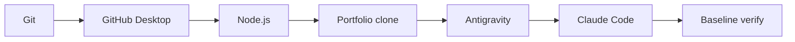

# Track 1 — First-time setup

**Goal:** Get one Windows PC ready to run the portfolio and the primary AI tools.

Install only the base layer now. OpenCode, OmniRoute, Strix, Supabase production
setup, GSAP/Lenis and extra MCP servers come later when a track actually needs
them.



> [!NOTE]
> **Terminal** means the PowerShell window where you type commands.

## 1. Install Git

**What it is:** Git records versions of the project.

**Where:** Windows PowerShell.

```powershell
winget install --id Git.Git -e --source winget
```

Close and reopen PowerShell, then:

```powershell
git --version
```

**Done when:** you see a Git version.

Official source: <https://git-scm.com/download/win>

## 2. Install GitHub Desktop

**What it is:** the normal graphical way you will pull, review, commit and push.

**Where:** browser → <https://desktop.github.com/>

1. Install it.
2. Sign in to the GitHub account that can access the portfolio.
3. Open **File → Options → Git** and confirm your commit name/email.

You still keep command-line Git because agents and troubleshooting use it.

## 3. Install Node.js LTS

**What it is:** Node.js runs Next.js and the portfolio's build/test scripts.

**Where:** browser → <https://nodejs.org/en/download>

The repository accepts Node `>=22`. Use the current LTS unless the repository
later pins a specific version.

Verify in a new PowerShell:

```powershell
node --version
npm --version
```

**Done when:** Node is 22+.

## 4. Install Antigravity

**What it is:** Google's agent environment. You will mainly use it for the
project editor, browser/visual QA and Gemini agent work.

**Where:** browser → <https://antigravity.google/download>

1. Install the Windows x64 build.
2. Sign in with the Google AI Pro account you want to keep as the stable
   Antigravity account.

Optional CLI, in PowerShell:

```powershell
irm https://antigravity.google/cli/install.ps1 | iex
```

If installed, verify:

```powershell
agy --version
```

**Last verified:** 2026-09-02.

## 5. Install Claude Code

**What it is:** your main coding harness for GLM-5.3 and DeepSeek V4 Flash
through the AgentRouter setup you already use.

**Where:** PowerShell.

```powershell
irm https://claude.ai/install.ps1 | iex
```

Verify:

```powershell
claude --version
claude doctor
```

> [!IMPORTANT]
> Do not change your working AgentRouter setup during portfolio work unless it
> is actually broken.

## 6. Clone the portfolio

**Where:** GitHub Desktop.

1. **File → Clone repository**.
2. Select/paste `mmoptibuilds-commits/mmoptibuilds-portfolio-yin-yang`.
3. Use a simple path such as:
   `C:\Users\<YOU>\Documents\GitHub\mmoptibuilds-portfolio-yin-yang`
4. Clone.

Do **not** place the Git repo inside a Syncthing folder.

## 7. Install packages and run the site

**Where:** GitHub Desktop → **Repository → Open in Terminal**.

```powershell
npm install
npm run dev
```

Open <http://localhost:3000>.

Stop the server with `Ctrl+C`.

## 8. Run the untouched baseline

**Where:** PowerShell in the portfolio root.

```powershell
npm run verify
```

Do this **before** redesign work. A baseline tells you whether a later failure
was caused by your change.

### If the baseline fails

**Open:** Antigravity with the portfolio folder as the Project.  
**Terminal:** PowerShell in that same folder.  
**Use:** Claude Code → GLM-5.3.  
**Give it:** `README.md`, `AGENTS.md`, `package.json`, and the exact failing
terminal output. Do **not** give secrets or `.env.local`.

### Paste this prompt

```text
You are diagnosing the untouched mmoptibuilds portfolio baseline.

READ FIRST
- README.md
- AGENTS.md
- package.json

INPUT
I will paste the exact output from npm run verify.

RULES
- Do not edit files.
- Do not install dependencies.
- Do not assume the failure is an application bug.
- Check documented Windows traps, stale servers, missing local dependencies,
  environment assumptions and test prerequisites first.

RETURN
1. The most likely root cause.
2. Evidence from the output/repository.
3. The safest exact command(s) for me to run next.
4. What result I should expect.
5. Whether any code change is actually necessary.

FAILURE OUTPUT:
<PASTE THE TERMINAL OUTPUT HERE>
```

### What you check yourself

- Is GLM asking you to delete files, reset Git, expose secrets or force-push?
  If yes, stop.
- Does its diagnosis match the actual error text?
- Try the least destructive command first.

### Pass to the next tool

If the baseline can be fixed without source edits, run the suggested safe
commands yourself and rerun:

```powershell
npm run verify
```

If a real source change is required, stop Track 1 and use
[Troubleshooting](../reference/troubleshooting.md) before continuing.

## 9. Final environment check

**Open:** Antigravity Project rooted at the portfolio folder.  
**Terminal:** start Claude Code from the same folder.  
**Use:** GLM-5.3, read-only.

### Paste this prompt

```text
Perform a read-only environment sanity check for this portfolio.

Run/read only:
- git status
- node --version
- npm --version
- README.md
- AGENTS.md
- package.json

Do not edit files.
Do not install packages.

Return:
- repository path
- current branch
- whether the working tree is clean
- detected Node/npm versions
- the project's main run command
- the project's main verification command
- the 5 most important AGENTS.md traps I should remember as a beginner
```

### What you check yourself

Confirm the returned repository path is the folder you cloned and the main
verification command is `npm run verify`.

### Pass to the next tool

Nothing yet. Close or keep the read-only Claude session. Continue to Track 2.

## Done when

- [ ] Git and GitHub Desktop work.
- [ ] Node is 22+.
- [ ] Antigravity opens and has the portfolio Project.
- [ ] Claude Code works with your AgentRouter setup.
- [ ] The site opens locally.
- [ ] You know whether the untouched `npm run verify` baseline passes.
- [ ] The AI sanity check points at the correct repository.

## Next

→ [Track 2 — Open and understand the existing project](02-open-and-understand-project.md)
