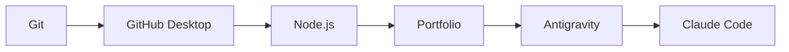

# Track 1 — First-time setup

**Goal:** Get one Windows PC ready to run the portfolio and the primary AI tools.

You are not configuring every tool in the ecosystem today. Install only the base
layer, prove it works, then move on.



> [!NOTE]
> **Terminal** means the PowerShell window where you type commands.  
> Open it from Start → search **PowerShell** → open Windows PowerShell or PowerShell 7.

## 1. Install Git

**What it is:** Git records versions of the project.

**Where:** Windows PowerShell.

```powershell
winget install --id Git.Git -e --source winget
```

Close PowerShell, open a new PowerShell window, then verify:

```powershell
git --version
```

**Done when:** you see a Git version number.

Official source: <https://git-scm.com/download/win>

## 2. Install GitHub Desktop

**What it is:** a graphical interface for Git. You will use it for the normal
human PC ↔ GitHub ↔ laptop workflow.

**Where:** browser.

1. Open <https://desktop.github.com/>.
2. Download and install GitHub Desktop.
3. Sign in with the GitHub account that can access the portfolio.
4. In GitHub Desktop, open **File → Options → Git** and confirm your commit name
   and email are correct.

> [!TIP]
> GitHub Desktop handles the everyday **commit / push / pull** flow. You still
> keep command-line Git installed because agents and troubleshooting often use it.

Official setup: <https://docs.github.com/en/desktop/installing-and-authenticating-to-github-desktop/setting-up-github-desktop>

## 3. Install Node.js LTS

**What it is:** Node.js runs the Next.js development/build tools.

The portfolio accepts Node `>=22`. As of 2026-09-02, Node **24 LTS** is the
recommended normal install. If the portfolio later pins a specific version,
follow the repository instead of this guide.

**Where:** browser.

1. Open <https://nodejs.org/en/download>.
2. Install the current **LTS** release for Windows.
3. Open a new PowerShell window.

Verify:

```powershell
node --version
npm --version
```

**Done when:** Node prints version 22 or newer and npm prints a version.

**Last verified:** 2026-09-02. Node download page listed v24.20.0 LTS.

## 4. Install Antigravity

**What it is:** Google's agent development environment. In this workflow, the
desktop/IDE surface is mainly the visual and browser-review home base.

**Where:** browser.

1. Open <https://antigravity.google/download>.
2. Download Antigravity for Windows x64.
3. Install it.
4. Sign in with the Google AI **Pro** account you want to keep as the stable
   Antigravity identity.

Optional Antigravity CLI, **PowerShell**:

```powershell
irm https://antigravity.google/cli/install.ps1 | iex
```

Verify the CLI if you installed it:

```powershell
agy --version
```

If `agy` is not found, close and reopen PowerShell first.

**Last verified:** 2026-09-02. Official Antigravity Windows installer supports
Windows 10 64-bit or later: <https://antigravity.google/download>.

## 5. Install Claude Code

**What it is:** the terminal agent harness used for GLM planning/review and
DeepSeek implementation through your existing AgentRouter setup.

**Where:** Windows PowerShell.

Recommended native installer:

```powershell
irm https://claude.ai/install.ps1 | iex
```

Verify:

```powershell
claude --version
claude doctor
```

`claude doctor` is a read-only health check.

> [!IMPORTANT]
> This guide assumes your existing AgentRouter configuration already makes
> **GLM-5.3** and **DeepSeek V4 Flash** work in Claude Code. Do not redesign the
> gateway configuration during portfolio work unless it is actually broken.

**Last verified:** 2026-09-02. Official install guide:
<https://code.claude.com/docs/en/setup>

## 6. Clone the portfolio

**Where:** GitHub Desktop.

1. Click **File → Clone repository**.
2. Select or paste:
   `mmoptibuilds-commits/mmoptibuilds-portfolio-yin-yang`.
3. Choose a simple local path such as:
   `C:\Users\<YOU>\Documents\GitHub\mmoptibuilds-portfolio-yin-yang`
4. Click **Clone**.

Do **not** put the Git repository inside a Syncthing folder.

## 7. Install project packages

**Where:** PowerShell opened inside the cloned portfolio folder.

In GitHub Desktop: **Repository → Open in Terminal**.

Then run:

```powershell
npm install
```

Start the site:

```powershell
npm run dev
```

Open <http://localhost:3000>.

Stop the dev server with `Ctrl+C`.

## 8. Run the first health check

**Where:** PowerShell in the portfolio folder.

```powershell
npm run verify
```

This is intentionally heavier than a normal quick check. The existing project
uses it as the main quality gate.

> [!IMPORTANT]
> If `npm run verify` fails on the untouched project, **do not start redesigning**.
> Open [Troubleshooting](../reference/troubleshooting.md) and fix the baseline
> first. Otherwise you cannot tell whether future failures were already there.

## Done when

- [ ] `git --version` works.
- [ ] GitHub Desktop is signed in.
- [ ] `node --version` is 22+.
- [ ] Antigravity opens and is signed in.
- [ ] `claude --version` and `claude doctor` work.
- [ ] The portfolio is cloned.
- [ ] `npm install` completes.
- [ ] `npm run dev` opens the site.
- [ ] You know whether the untouched `npm run verify` baseline passes.

## Next

→ [Track 2 — Open and understand the existing project](02-open-and-understand-project.md)
