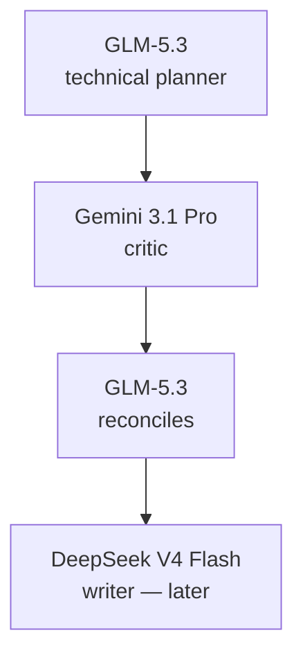

# Track 3 — First safe agent session

**Goal:** Complete the first planning cycle without letting multiple agents fight
over the repository.

## Before you start

In GitHub Desktop:

1. Fetch/pull `main`.
2. Create a branch such as `chore/project-state-audit`.
3. Open the same branch/folder in Antigravity.

## Roles for this session



For this first session, stop after the reconciled plan. Do not redesign the site
yet.

## 1. Start GLM in Claude Code

**Where:** Antigravity integrated PowerShell terminal, portfolio folder.

```powershell
claude
```

Use your existing AgentRouter profile/model selection for **GLM-5.3**.

Run:

```text
/status
/context
```

Then paste the **Repo Audit** prompt from
[Core workflow prompts](../prompts/core-workflow.md).

Ask GLM to **read only**.

## 2. Give the plan to Gemini

**Where:** Gemini app, Gemini 3.1 Pro.

Use the **Gemini Plan Critique** prompt.

Give Gemini:

- GLM's plan;
- only the relevant project brief/route screenshots if they help;
- the key business goals from this guide.

Do not paste API keys, `.env.local`, enquiry data or unrelated chat history.

## 3. Reconcile with GLM

Return to GLM and paste Gemini's critique using the **GLM Reconcile** prompt.

GLM must decide:

- accept;
- reject with reason;
- modify.

The output becomes the implementation brief—not Gemini's critique by itself.

## 4. Decide whether a full pipeline is justified

Use the full pipeline for:

- homepage redesign;
- new Studio/Systems conversion flow;
- admin behavior;
- backend/data changes;
- advanced motion;
- SEO architecture;
- performance/security fixes.

Use a smaller loop for:

- copy typo;
- isolated style token;
- one proven test repair;
- docs-only edit.

## 5. Learn `/goal` and `/loop` now—not earlier

### Use `/goal` after the plan is bounded

Example:

```text
/goal Continue until the approved homepage task is implemented, its targeted
tests pass, npm run verify passes, and no files outside the approved scope are
modified.
```

Do not use `/goal` for “make it amazing.”

### Use `/loop` for repeated checks

Example:

```text
/loop 5m Check the preview deployment status. If it changed, report the new
status. Do not modify code.
```

Do not use `/loop` as an endless design improver.

Full details:
[Claude Code reference](../reference/claude-code.md).

## 6. One-writer checkpoint

Before implementation, write this at the top of the task/handoff:

```text
PRIMARY WRITER: DeepSeek V4 Flash in Claude Code
READ-ONLY REVIEWERS: GLM, Gemini/Antigravity, OpenCode reviewers
WORKTREE EXCEPTIONS: none for this task
```

If another agent needs to edit, stop the writer or create an isolated worktree.

## 7. Permissions

Normal Windows host:

- planning → read-only/plan mode;
- implementation → high autonomy inside repo with controlled permission rules;
- no automatic deployment;
- no secret access;
- no force push;
- no broad file deletion.

Read [Claude Code permissions](../reference/claude-code.md) before using
`bypassPermissions`.

## Done when

- [ ] You created a task branch.
- [ ] GLM produced a read-only audit/plan.
- [ ] Gemini critiqued it.
- [ ] GLM reconciled the critique.
- [ ] The implementation brief has measurable success conditions.
- [ ] One primary writer is named.
- [ ] No code was changed by competing agents.

## Next

→ [Track 4 — Design and build loop](04-design-and-build-loop.md)
