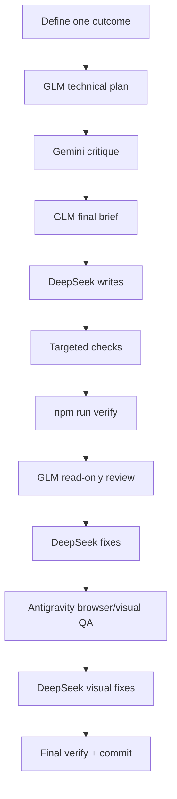

# Track 4 — Design and build loop

**Goal:** Use the same predictable loop for every meaningful design/feature
task.

## First choose the route's job

Do not use one design goal everywhere.

| Route | Optimize for |
|---|---|
| `/` | memorability, credibility, strong art direction, obvious division entry |
| `/studio` | proof, positioning, differentiation, website-client conversion |
| `/systems` | clarity, technical trust, requirement-led enquiry conversion |
| `/admin` | speed, scanability, low error rate |

## The loop



## 1. Define one outcome

Good:

> Improve the homepage hero so a first-time visitor understands mmoptibuilds,
> sees the dual Studio/Systems identity and can enter either division within one
> screen, while preserving current verification budgets.

Bad:

> Redesign the whole site and make it Awwwards level.

The bad version contains too many decisions for one safe branch.

## 2. Create the task branch

**Where:** GitHub Desktop.

Example:

```text
feat/gateway-entry-hierarchy
```

Pull `main` first.

## 3. Plan with GLM

Use the prompts in
[Core workflow prompts](../prompts/core-workflow.md).

GLM should name:

- exact owned files;
- behavior to preserve;
- success conditions;
- test commands;
- whether a new dependency is justified.

## 4. Critique with Gemini

Use screenshots/references when visual judgment matters.

Ask Gemini to critique the **plan first**, not edit code.

## 5. Let GLM reconcile

This stops the common failure where a visual critic suggests something
beautiful but technically incompatible with the current codebase.

The reconciled brief is the contract for the writer.

## 6. DeepSeek implements

DeepSeek is the default writer.

During implementation, use narrow checks before the full gate:

```powershell
npm run typecheck
npm run lint
npm run test
```

For responsive/accessibility work, run the relevant project checks too.

Do not run the full `npm run verify` after every two-line edit; run it when a
coherent implementation is ready.

## 7. Review in code, then in the browser

**Code review:** GLM reads the diff.  
**Visual/browser review:** Antigravity + Gemini reviews the running result.

Code can be logically correct and still look wrong. A screenshot can look good
while hiding keyboard, no-JS or bundle regressions. You need both viewpoints.

## 8. Commit only after the result is coherent

**Where:** GitHub Desktop.

Before commit:

- inspect diff;
- confirm no secret/customer file is staged;
- ensure `npm run verify` passes;
- record meaningful project-state/agent-log updates if this milestone needs them.

Then commit and push.

## When to use advanced motion

Before adding GSAP, Lenis, WebGL, frame sequences or shaders, open
[UI, motion + skills](../reference/ui-motion-and-skills.md).

The current portfolio already removed unused animation libraries because CSS
handled the existing behavior with lower bundle cost. A new effect must beat
that baseline, not merely look exciting in a demo.

## When to use subagents

Use them for independent **read-only** work first:

- codebase reconnaissance;
- test output summarization;
- accessibility scan;
- current library documentation;
- diff review.

Parallel writers require worktrees. See
[Subagents, MCP + hooks](../reference/subagents-mcp-and-hooks.md).

## Done when

- [ ] The branch has one clear outcome.
- [ ] GLM plan exists.
- [ ] Gemini critique was reconciled, not copied blindly.
- [ ] One agent wrote the change.
- [ ] Targeted checks pass.
- [ ] `npm run verify` passes.
- [ ] GLM code review has no unresolved blocker/high finding.
- [ ] Antigravity visual QA was completed for visible changes.
- [ ] Diff was reviewed before commit.

## Next

→ [Track 5 — Quality and polish](05-quality-and-polish.md)
