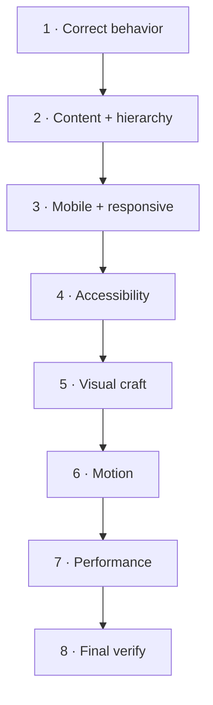
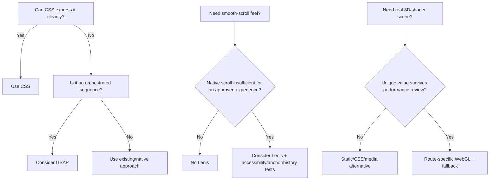

# Track 5 — Quality and polish

**Goal:** Turn “the feature works” into “the feature is intentional, responsive,
accessible, fast and visually strong.”

Do not polish by randomly adding effects. Polish in this order:



Keep the same task branch from Track 4.

---

# 1. Correct behavior first

**Open:** Claude Code, portfolio root.  
**Use:** DeepSeek V4 Flash if code still needs fixing; GLM-5.3 if you only need a
read-only diagnosis.  
**Give it:** final task brief + current diff + relevant failing output.

### Paste this prompt

```text
Audit the current task for functional completeness before visual polish.

READ
- final implementation brief
- current diff
- relevant tests/source
- README.md
- AGENTS.md

DO NOT redesign.
DO NOT add visual effects.

Check:
- the requested user behavior actually exists
- success paths
- failure/error paths
- forms/admin state where relevant
- direct route refresh
- no-JS behavior where relevant
- keyboard behavior where relevant
- stale or missing loading/empty/error states

RETURN
BLOCKER/HIGH/MEDIUM/LOW findings with exact evidence and the smallest fix.
Do not edit unless I explicitly tell you to.
```

### What you check yourself

Use the feature manually. Do not move on because the agent says it works.

### Pass to the next tool

If blocker/high behavior bugs exist, give them to DeepSeek to fix, then run:

```powershell
npm run typecheck
npm run lint
npm run test
```

---

# 2. Content + hierarchy review

**Open:** Gemini App or Antigravity.  
**Use:** Gemini 3.1 Pro for the important route; Flash is fine for a quick
secondary pass.  
**Give it:** current page screenshots, project brief, route goal.

### Paste this prompt

```text
Review the current <ROUTE> for content hierarchy and conversion before visual polish.

PROJECT GOAL
<PASTE ROUTE GOAL>

CHECK
- Can a first-time visitor understand the page quickly?
- Is the primary action obvious?
- Is important proof visible before decorative explanation?
- Does the copy sound specific to mmoptibuilds rather than generic agency/AI copy?
- Are Studio/Systems boundaries truthful and clear?
- Are there vague claims, filler, repeated ideas or unnecessary sections?
- Is the page scannable on mobile?
- Does every section earn its place?

DO NOT invent copy claims, metrics, clients or testimonials.
DO NOT propose effects yet.

RETURN
KEEP
CUT
REWRITE
REORDER
MISSING

For each suggestion explain the user/business reason.
```

### What you check yourself

You should agree with the **reason**, not just the wording.

### Pass to the next tool

Give only accepted content/hierarchy changes to GLM if they affect architecture,
or directly to DeepSeek if they are small and within the approved task.

---

# 3. Mobile + responsive review

**Run first:**

```powershell
npm run check:responsive
```

Inspect the generated screenshots yourself.

Then use Antigravity.

**Open:** Antigravity Project, dev server running.  
**Use:** Gemini 3.7 Flash for wide coverage.  
**Mode:** `/browser`, read-only.

### Paste this prompt

```text
/browser

Perform a read-only responsive QA pass for:
<ROUTE>

Test approximately:
320
360
375
390
430
768
1024
1280
1440
1920 px

CHECK
- horizontal overflow
- text clipping
- awkward line breaks
- image/media crop
- navigation
- section spacing
- touch target size
- content order
- CTA visibility
- sticky/fixed behavior
- scroll interactions
- desktop elements that simply collapse badly on mobile

IMPORTANT
Mobile must be intentionally composed, not merely desktop stacked vertically.

DO NOT EDIT FILES.

RETURN
P0 broken
P1 high impact
P2 polish

For every finding include viewport + exact location + desired outcome.
Also list what is already working well and should be preserved.
```

### What you check yourself

Open at least one phone width and one desktop width yourself.

### Pass to the next tool

Give accepted P0/P1 findings to DeepSeek with the visual-fix prompt from Track 4.

---

# 4. Accessibility review

Run:

```powershell
npm run check:a11y
npm run check:keyboard
```

Then do your own quick manual check:

1. `Tab` through the page.
2. `Shift+Tab` backwards.
3. Zoom browser to 200%.
4. Turn on reduced motion.
5. Confirm visible focus.
6. Confirm no important information depends only on hover.
7. Confirm form errors are understandable.

Then ask GLM or a dedicated accessibility reviewer.

### Paste this prompt

```text
Perform a read-only accessibility review of the current task.

READ
- current diff
- relevant route/components
- existing a11y/keyboard test scripts
- README.md / AGENTS.md constraints

CHECK
- semantic structure
- headings/landmarks
- accessible names
- keyboard path
- focus visibility/order
- dialog/menu behavior
- touch target implications
- color/contrast risks
- reduced motion
- no-JS fallbacks
- form labels/errors/status announcements
- zoom/narrow viewport risks

Do not report theoretical ARIA preferences when native semantic HTML already
solves the problem.

RETURN evidence-backed findings only:
BLOCKER / HIGH / MEDIUM / LOW
+ file/location
+ why
+ smallest fix
+ verification command/manual check.

Do not edit.
```

### What you check yourself

Automated “0 violations” is useful evidence, but not proof of perfect
accessibility. Your keyboard/reduced-motion check still matters.

### Pass to the next tool

Accepted findings → DeepSeek → rerun the affected checks.

---

# 5. Visual craft pass

Now use the curated design skills.

Recommended order:

1. **Impeccable** — systematic critique/audit.
2. **Taste Skill** — only if the result still feels generic or AI-made.
3. **Checklist Design** — milestone audit.
4. **Emil Kowalski skills** — when motion needs specialist review.

Do not run every skill on every edit.

If Impeccable is installed in the harness, use the appropriate command such as
`/impeccable critique` or `/impeccable audit`.

### Paste this prompt after invoking the skill

```text
Audit <ROUTE> as a real mmoptibuilds product, not as a component-demo page.

ROUTE MODE
<Experience / Persuade / Operate>

PROJECT GOAL
<PASTE GOAL>

FOCUS
- hierarchy
- typography
- rhythm/spacing
- composition
- visual identity
- originality
- density
- affordances
- interaction states
- consistency with the route's role
- mobile composition

ANTI-PATTERNS
- generic purple gradients
- endless glass cards
- effect stacking
- random marquee walls
- copied component-library identity
- fake proof
- decorative elements that weaken conversion

Return the smallest set of high-impact improvements.
Do not edit until I approve them.
```

### What you check yourself

Ask: “Does this feel more like **mmoptibuilds**, or just more decorated?”

### Pass to the next tool

Accepted design findings → GLM if they materially change the plan; otherwise
DeepSeek for scoped polish.

---

# 6. Decide whether advanced motion earns its cost

The current portfolio intentionally removed unused animation libraries. CSS
already handles existing interactions efficiently.

Use this decision rule:



If any advanced dependency is proposed, **do not install it yet**.

**Use:** GLM-5.3, read-only.

### Paste this prompt

```text
Review whether the proposed advanced visual dependency is justified.

PROPOSED EFFECT
<DESCRIBE THE EXACT SEQUENCE>

CANDIDATE
<GSAP / Lenis / Three.js / shader / other>

CURRENT IMPLEMENTATION
<DESCRIBE OR LET THE AGENT INSPECT>

COMPARE
1. existing CSS/native solution
2. candidate dependency solution

RETURN
- user/design benefit
- why current tools are insufficient
- exact route(s) that need it
- bundle/runtime cost
- accessibility risks
- reduced-motion fallback
- mobile/weak-device fallback
- anchor/history/keyboard risks if scroll is modified
- removal plan if it fails performance review
- recommendation: APPROVE / REJECT / PROTOTYPE IN ISOLATION

Do not install anything.
```

### What you check yourself

Approve only when you can name the visual/user benefit in one sentence.

### Pass to the next tool

If approved, give the approval to DeepSeek.

For GSAP only after approval:

```powershell
npm install gsap
```

For Lenis only after approval:

```powershell
npm install lenis
```

Do not install Three/WebGL packages until a specific approved scene names the
required packages.

### Paste this prompt for the approved implementation

```text
Implement only the approved advanced-motion sequence.

APPROVAL
<PASTE GLM APPROVAL>

RULES
- keep the dependency route-scoped/dynamically loaded where practical
- provide reduced-motion fallback
- provide mobile/weak-device fallback
- preserve navigation, anchors, keyboard and focus
- do not turn normal scrolling into a trap
- clean up observers/timelines/listeners
- keep static meaningful content available without the effect

AFTER IMPLEMENTATION RUN
npm run typecheck
npm run lint
npm run test
npm run check:keyboard
npm run check:responsive
npm run check:bundle
npm run check:perf
npm run verify

Report before/after bundle/performance evidence.
```

### What you check yourself

If it is prettier but measurably worse and not more useful, remove it.

---

# 7. Performance review

Run:

```powershell
npm run check:bundle
npm run check:perf
```

Use GLM read-only if numbers regress.

### Paste this prompt

```text
Analyze the performance/bundle impact of the current task.

INPUT
- current diff
- check:bundle output
- check:perf output
- relevant route/components

CHECK
- new client-side JS
- global vs route-specific imports
- image/media weight
- unnecessary hydration
- animation/event-listener cost
- layout shift
- likely LCP/CLS impact
- duplicate libraries
- client imports pulling server/schema packages

Use AGENTS.md documented bundle traps.

RETURN
1. regression evidence
2. likely root cause
3. smallest optimization
4. exact command to verify it

Do not edit.
```

### What you check yourself

Do not optimize arbitrary code if the metrics already remain comfortably within
the project's budget.

### Pass to the next tool

Only evidence-backed regressions → DeepSeek.

---

# 8. Final quality gate

After every accepted quality fix:

```powershell
npm run verify
```

Then redo the most relevant browser check.

### Paste this prompt

```text
Perform a final read-only milestone review.

Check the final branch against:
- original task outcome
- final implementation brief
- accepted code-review findings
- accepted visual findings
- mobile
- accessibility
- performance
- truthful content
- documentation state

Return only:
READY
or
NOT READY

If NOT READY, list only release-blocking/high-impact gaps with evidence.
Do not invent optional polish to keep the task open forever.
```

### What you check yourself

You personally decide when optional polish stops.

## Done when

- [ ] behavior is correct;
- [ ] hierarchy/conversion make sense;
- [ ] mobile is intentionally designed;
- [ ] keyboard/reduced-motion work;
- [ ] visual craft feels authored;
- [ ] advanced motion exists only when justified;
- [ ] bundle/performance checks remain healthy;
- [ ] `npm run verify` passes after final fixes;
- [ ] no unresolved blocker/high finding remains.

## Next

→ [Track 6 — Backend, admin and data](06-backend-admin-and-data.md)
