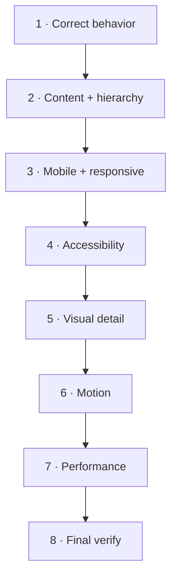

# Track 5 — Quality and polish

**Goal:** Turn “it works” into “it is credible, intentional and release-quality.”

Do not polish by randomly adding effects. Polish in layers.

## Quality order



## 1. Correct behavior

Run the narrow tests relevant to the changed route/feature.

Typical:

```powershell
npm run typecheck
npm run lint
npm run test
```

If a form/admin flow changed, test success **and failure** paths, not only the
happy path.

## 2. Content and hierarchy

Ask:

- What is this page trying to make the visitor understand?
- What is the primary action?
- Is proof honest?
- Is the most important sentence visible before decorative explanation?
- Does the page feel specific to mmoptibuilds?

Use Gemini/Antigravity prompts from
[Visual + quality prompts](../prompts/visual-and-quality.md).

## 3. Mobile composition

The current verification suite already checks many widths, but automation cannot
judge whether the composition feels good.

Run:

```powershell
npm run check:responsive
```

Then inspect the generated screenshots.

Use Antigravity `/browser` for changed routes.

## 4. Accessibility

Run:

```powershell
npm run check:a11y
npm run check:keyboard
```

Manually check:

- Tab through everything.
- Use `Shift+Tab` backwards.
- Test 200% browser zoom.
- Enable reduced motion.
- Check focus is always visible.
- Check important content still exists without hover.
- Check form errors make sense.

Automated axe results are signals, not proof that the experience is fully
accessible.

## 5. Visual details

Only now tune:

- typography;
- line lengths;
- spacing rhythm;
- image crops;
- borders/material language;
- icon alignment;
- hover/press feedback;
- transitions.

Use **Taste Skill** or an independent Gemini critique when the page feels
generic but you cannot explain why.

## 6. Motion

Read [UI, motion + skills](../reference/ui-motion-and-skills.md).

Add complexity only when a named sequence needs it.

After motion changes, retest reduced motion and keyboard behavior.

## 7. Performance

Run:

```powershell
npm run check:bundle
npm run check:perf
```

Remember a new animation library can pass TypeScript and still be the wrong
decision because it increases every route's JS.

## 8. Full gate

```powershell
npm run verify
```

Do not call the branch finished if this fails.

## 9. Code review + visual review

- GLM: read-only diff review.
- DeepSeek: fix accepted findings.
- Antigravity/Gemini: browser/visual review.
- DeepSeek: fix accepted visual findings.
- `npm run verify` again after final code changes.

## 10. Screenshot evidence

For major visual milestones, keep useful **review evidence** outside production
data. The project already writes verification screenshots to a git-ignored
directory.

Never capture admin pages containing real enquiry/customer data for an AI review.

## Done when

- [ ] Correct behavior passes targeted checks.
- [ ] Mobile is intentionally composed.
- [ ] Keyboard + reduced motion work.
- [ ] No important content depends on hover or JavaScript reveal.
- [ ] Visual polish supports hierarchy/conversion.
- [ ] Motion has a named purpose.
- [ ] Bundle/perf checks pass.
- [ ] `npm run verify` passes after the final fix.
- [ ] Code and browser reviews have no unresolved high-impact issue.

## Next

→ [Track 6 — Backend, admin and data](06-backend-admin-and-data.md)
