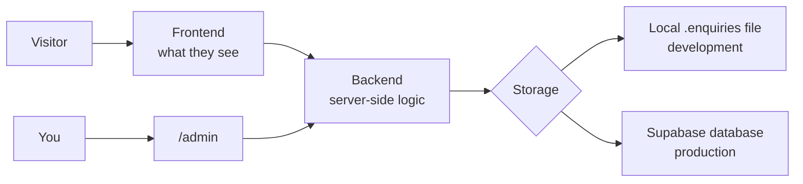

# Track 6 — Backend, admin and data

**Goal:** Understand the existing enquiry/admin flow, prove it locally, then
connect Supabase/Turnstile only when you are ready for production-like behavior.

You do **not** need to become a backend engineer first.

## What these words mean



- **Frontend** — the pages/buttons/forms visitors interact with.
- **Backend** — code that runs privately on the server.
- **Database** — structured information that survives between visits.
- **Authentication** — proves who you are.
- **Authorization** — decides what an authenticated person is allowed to do.
- **Environment variable** — configuration supplied outside source code.
- **Secret** — an environment value that must never be committed or pasted into AI.

## 1. Understand what already exists

The project already chooses storage automatically:

```text
No Supabase variables
→ .enquiries/enquiries.json
→ full local development flow

Supabase variables configured
→ Supabase/Postgres
→ production-style storage/auth path
```

So **do not create a database just to begin testing the forms.**

## 2. Prove the local enquiry → admin flow yourself

**Open:** Antigravity Project.  
**Terminal A:** portfolio root.

If you need the local admin shortcut, copy `.env.example` to `.env.local` and set
only a local development password yourself.

PowerShell:

```powershell
Copy-Item .env.example .env.local
```

Then edit `.env.local` manually and set:

```text
ADMIN_DEV_PASSWORD=<YOUR LOCAL-ONLY PASSWORD>
```

Do not put the real value into an AI prompt.

Start:

```powershell
npm run dev
```

With **synthetic data only**:

1. submit a Contact enquiry;
2. submit a Studio enquiry;
3. submit a Systems enquiry;
4. record reference-ID behavior;
5. open `/admin`;
6. confirm the enquiries appear;
7. test one invalid submission;
8. test duplicate/retry behavior if practical.

### Ask GLM to audit the backend only after you have tried it

**Open:** Claude Code → GLM-5.3, read-only.  
**Give it:** `README.md`, `AGENTS.md`, `.env.example`, enquiry/server-action
files, owner-auth files, Supabase migrations, and your **synthetic** test notes.

### Paste this prompt

```text
Perform a read-only backend/admin audit of the existing mmoptibuilds portfolio.

READ
- README.md
- AGENTS.md
- .env.example
- enquiry Server Action/storage/auth files
- admin route/components
- Supabase migrations/policies
- relevant tests/scripts

CURRENT FACTS
- local file storage is a real development backend, not a stub
- production may use Supabase
- production secrets/customer data must never enter prompts
- /admin is owner-only and noindex
- public forms must remain validated, deduplicated and abuse-resistant

MY SYNTHETIC MANUAL TEST NOTES
<PASTE NOTES WITHOUT REAL CUSTOMER DATA>

RETURN
1. current local request/data flow
2. current production Supabase request/data flow
3. what already works
4. what is still production-incomplete
5. auth vs authorization boundary
6. current RLS/data-security controls
7. exact production setup prerequisites
8. exact tests/checks before enabling production data

Do not edit files.
Do not ask for secret values.
```

### What you check yourself

The answer must distinguish:

- local dev password vs real production auth;
- signed-in user vs authorized owner;
- public form access vs private table access.

### Pass to the next tool

Keep this audit. Use it only when you are ready to connect Supabase.

---

# 3. Decide whether you actually need Supabase now

Use Supabase when you need:

- persistent production enquiry storage;
- owner authentication;
- database-backed `/admin`;
- production release readiness.

If you are still redesigning pages and the local file backend works, you can
continue without it.

When ready, read
[Supabase, backend + admin](../reference/supabase-backend-and-admin.md).

---

# 4. Plan the Supabase connection before touching secrets

**Open:** Claude Code → GLM-5.3, read-only.  
**Give it:** backend audit + `.env.example` + `supabase/migrations/` + current
auth/store files.

### Paste this prompt

```text
Create a production-safe Supabase setup plan for this EXISTING repository.

DO NOT edit files.
DO NOT ask me to paste secrets.
DO NOT redesign the schema unless evidence shows the current migrations are wrong.

READ
- .env.example
- current Supabase migrations
- storage adapter
- owner auth
- admin data access
- tests

RETURN EXACTLY
A. What I must do manually in the Supabase dashboard
B. What commands I run locally
C. Which environment-variable NAMES are required
D. Which values are public vs server-only secrets
E. Migration/RLS verification
F. How I make my authenticated user an owner
G. How to test with synthetic data
H. Rollback/recovery if setup fails
I. What must be configured later in Cloudflare production

Use the repository's current variable names and commands, not generic examples.
```

### What you check yourself

The plan should use the repo's current variable names:

```text
NEXT_PUBLIC_SUPABASE_URL
NEXT_PUBLIC_SUPABASE_PUBLISHABLE_KEY
SUPABASE_SECRET_KEY
```

It should never tell you to commit real values.

### Pass to the next tool

You now follow the manual/dashboard steps yourself. AI does not need to see the
secret values.

---

# 5. Create/connect the Supabase project

**Where:** Supabase dashboard in your browser.

Create or select the project intended for this website.

You will need to collect, privately:

```text
Project URL
Publishable key
Secret/service key
Project ref
```

> [!CAUTION]
> The secret/service key can bypass Row Level Security. Never paste it into a
> prompt, screenshot, issue, README or Git commit.

## Local environment

Open `.env.local` yourself and fill:

```text
NEXT_PUBLIC_SUPABASE_URL=<YOUR PROJECT URL>
NEXT_PUBLIC_SUPABASE_PUBLISHABLE_KEY=<YOUR PUBLISHABLE KEY>
SUPABASE_SECRET_KEY=<YOUR SECRET KEY>
```

The guide intentionally does **not** ask an agent to type the real values.

## Link the Supabase CLI

**Where:** PowerShell in portfolio root.

```powershell
npx supabase link --project-ref <YOUR_PROJECT_REF>
```

Then apply the repository migrations:

```powershell
npx supabase db push
```

Read the output before continuing.

---

# 6. Verify migrations + RLS with an agent, without secrets

**Open:** Claude Code → GLM-5.3, read-only.  
**Give it:** migration files + command output with any secret/token redacted.

### Paste this prompt

```text
Review the current Supabase migration/RLS setup after I linked the project.

INPUT
- repository migration files
- redacted output from supabase db push
- current data-access/auth files

DO NOT
- request keys
- make production writes
- change schema
- assume "authenticated" means "owner"

CHECK
- RLS enabled where expected
- public users cannot directly read private enquiry tables
- public submission path is narrow/controlled
- owner authorization is enforced server-side and by policies where appropriate
- secret/service key remains backend-only
- audit/consent behavior is preserved
- schema matches current application assumptions

RETURN
BLOCKER / HIGH / MEDIUM / LOW findings
+ exact migration/policy evidence
+ exact verification step.

Do not edit.
```

### What you check yourself

If GLM finds a blocker/high issue, do **not** put real production enquiries into
the database yet.

### Pass to the next tool

Accepted migration/policy fix → DeepSeek on a dedicated branch, then re-run the
Supabase verification before proceeding.

---

# 7. Create your real owner account

The repository README currently documents an `owner_accounts` authorization
layer.

First create/sign in to the production Supabase Auth user you intend to own the
admin account.

Then add that user's ID to `owner_accounts` using the secure method described by
the current repository/database setup.

The current repo README shows the intended SQL shape:

```sql
insert into owner_accounts (user_id, label)
values ('<your-auth-user-id>', 'founder');
```

> [!CAUTION]
> Run this only in your own authorized Supabase project. Do not ask an AI agent
> to guess your user ID.

### Ask GLM to verify the authorization design

```text
Review the owner authorization path for /admin.

Do not edit.
Do not access production personal data.

Verify:
- authentication proves identity
- owner_accounts (or current equivalent) grants owner authorization
- a normal authenticated non-owner cannot access owner data/actions
- anonymous access fails
- admin remains noindex and absent from public navigation/sitemap
- secret/service credentials are not exposed client-side

Return exact tests I should run with:
1. anonymous user
2. authenticated non-owner
3. owner
```

### What you check yourself

Test all three roles with synthetic data.

### Pass to the next tool

If authorization fails, give the evidence to GLM for a fix plan, then DeepSeek
implements only that approved fix.

---

# 8. Turnstile: add bot protection only after the form works

The repo's current variables are:

```text
NEXT_PUBLIC_TURNSTILE_SITE_KEY
TURNSTILE_SECRET_KEY
```

Create the Turnstile widget in your Cloudflare account when you are preparing a
real environment.

Put the site key and secret into the appropriate local/production environment
yourself. Never paste the secret into AI.

### Paste this prompt for verification

**Use:** GLM read-only.

```text
Audit the existing Turnstile integration without changing code.

READ
- .env.example
- form UI
- enquiry Server Action
- validation/abuse controls
- relevant tests

CHECK
- browser site key usage
- server-side secret verification
- missing/invalid/expired token behavior
- failure behavior does not silently lose a valid enquiry
- validation ordering still follows AGENTS.md
- Turnstile is not treated as the only abuse control

Return evidence-backed gaps and exact tests.
Do not ask for real keys.
```

### What you check yourself

The Turnstile secret must remain server-only.

### Pass to the next tool

Only accepted code gaps → DeepSeek → targeted tests → `npm run verify`.

---

# 9. Admin usability review

Once the database/auth path works, review `/admin` as an owner tool.

**Open:** Antigravity `/browser`.  
**Use:** Gemini 3.1 Pro if the workflow is complex.  
**Data:** synthetic only.

### Paste this prompt

```text
/browser

Perform a read-only owner-workflow QA review of /admin using SYNTHETIC data only.

DO NOT edit files.
DO NOT capture or expose real customer data.

Test:
- sign in / denied access
- inbox/list scanning
- filters/search if present
- enquiry detail
- status changes
- notes
- quote/follow-up fields if present
- empty/loading/error states
- keyboard navigation
- mobile/tablet behavior where owner use is plausible
- destructive action clarity
- privacy/noindex assumptions visible from the implementation

PRIORITY
1. security/privacy
2. correctness
3. scan speed
4. low error rate
5. responsive usability
6. visual polish

RETURN P0/P1/P2 findings with exact workflow/location and desired outcome.
```

### What you check yourself

Can **you** quickly find a synthetic enquiry and understand what to do next?

### Pass to the next tool

Accepted findings → DeepSeek → relevant tests → `npm run verify`.

---

# 10. Final backend/admin gate

Run:

```powershell
npm run verify
```

Then manually complete one synthetic end-to-end flow:

```text
public form
→ validation
→ reference/result
→ storage
→ /admin
→ owner action
```

### Final handoff prompt

```text
Update the project handoff/docs for the backend/admin milestone.

Record:
- local vs production storage status
- Supabase linked? yes/no
- migration version/status
- RLS/owner authorization test result
- Turnstile configured? yes/no
- synthetic end-to-end test result
- known production blockers
- no secret values
- next action

Update PROJECT-STATE / ROADMAP / agent log only where relevant.
```

### What you check yourself

Read the docs and confirm they contain **status**, not secret values.

### Pass to the next tool

The next tool is Track 7's release/SEO/security workflow. Do not deploy yet.

## Done when

- [ ] local form → admin flow works with synthetic data;
- [ ] you understand frontend/backend/database/auth at a practical level;
- [ ] Supabase is connected only when actually needed;
- [ ] real secrets live only in environment storage;
- [ ] migrations/RLS were reviewed;
- [ ] owner vs non-owner authorization was tested;
- [ ] Turnstile is server-verified if enabled;
- [ ] `/admin` was tested as an owner workflow;
- [ ] `npm run verify` passes after backend changes;
- [ ] project docs accurately record production readiness.

## Next

→ [Track 7 — SEO, security and launch](07-seo-security-and-launch.md)
