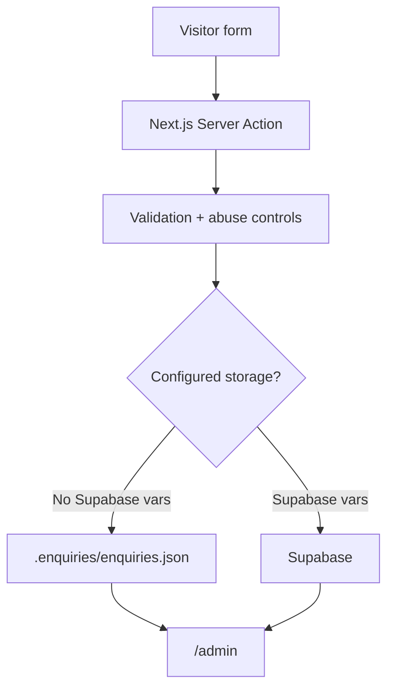

# Track 6 — Backend, admin and data

**Goal:** Understand and verify the existing enquiry/admin system before
connecting live services.

## Do not start by creating a database

The project already supports a local file backend.



This lets you test the business flow before production infrastructure.

## 1. Verify local form → admin flow

**Where:** PowerShell, project root.

Make sure `.env.local` is configured only for local development as described by
the current repo.

Start:

```powershell
npm run dev
```

Test with **synthetic** data:

1. Submit a contact/Studio/Systems enquiry.
2. Record the reference behavior.
3. Open `/admin`.
4. Confirm the enquiry appears.
5. Confirm duplicates/rate limits/errors behave as expected.

Never use a real customer's private details for AI/browser testing.

## 2. Understand the security boundary

A signed-in Supabase user is not automatically an owner.

Production owner access depends on current database policies and
`owner_accounts`. Read the migration and current README before configuring it.

## 3. Only connect Supabase when needed

Use [Supabase, backend + admin](../reference/supabase-backend-and-admin.md).

Do not give a coding agent unrestricted production database write access.

## 4. Verify admin as a product

The admin route is not an Awwwards canvas.

Use the Admin Usability prompt in
[Visual + quality prompts](../prompts/visual-and-quality.md).

Prioritize:

- fast scanning;
- clear state;
- low-risk actions;
- privacy;
- keyboard;
- errors;
- owner recovery.

## 5. Understand hosting before deploying

Read [Cloudflare, hosting + domain](../reference/hosting-cloudflare-and-domain.md).

The important current rule:

> Keep the working OpenNext deployment path for this existing portfolio.
> Evaluate vinext later as a separate compatibility/migration task.

## 6. Production data checklist

- [ ] `.env.local` is ignored by Git.
- [ ] No production secrets are in prompts/logs/screenshots.
- [ ] Supabase RLS/owner authorization are tested.
- [ ] Public forms cannot directly read private enquiry tables.
- [ ] Duplicate retries do not create duplicate enquiries.
- [ ] Notification failure does not lose stored enquiry data.
- [ ] Analytics receive no personal enquiry payload.
- [ ] Admin is noindex and absent from public navigation/sitemap.
- [ ] Backup/export/rollback approach is known.

## Next

→ [Track 7 — SEO, security and launch](07-seo-security-and-launch.md)
