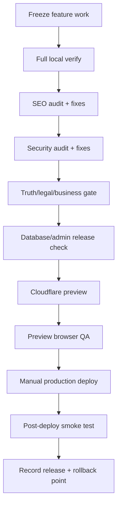

# Track 7 — SEO, security and launch

**Goal:** Turn the finished portfolio into a production release without losing
the quality, security or truthfulness you built.

> [!IMPORTANT]
> This track is a **release gate**, not another design sprint.

## Release order



---

# 1. Freeze feature work

**Where:** GitHub Desktop.

Create/finalize a release branch, for example:

```text
release/mmoptibuilds-launch
```

From this point:

- no unrelated redesign;
- no experimental package;
- no “one more cool animation”;
- no schema change without release reason.

---

# 2. Run the full local gate

**Where:** PowerShell in the portfolio root.

```powershell
npm run verify
```

If this fails, stop and fix it before SEO/security/deployment.

### If you need a diagnosis

**Use:** GLM-5.3, read-only.  
**Give it:** failing output + current diff + `README.md` + `AGENTS.md`.

### Paste this prompt

```text
Diagnose the release-candidate npm run verify failure.

DO NOT edit yet.
DO NOT hide or disable a verification gate.

READ
- exact failing output
- current diff
- README.md
- AGENTS.md
- relevant source/test files

RETURN
1. root cause with evidence
2. whether the release branch caused it
3. smallest safe fix
4. exact targeted command proving the fix
5. whether the full npm run verify must be rerun (normally yes)
```

### What you check yourself

Do not accept “skip the test” as a release fix.

### Pass to the next tool

Accepted fix → DeepSeek → targeted check → full `npm run verify`.

---

# 3. SEO audit

The project already has typed content, metadata helpers, sitemap/robots,
canonicals and structured-data foundations. Improve those instead of bolting on
a random SEO plugin.

## Use the specialist skill only now

If **Claude SEO** is installed, use it in this late-stage audit. Otherwise GLM
can perform the same scoped review.

**Open:** Claude Code, release branch.  
**Use:** GLM-5.3 + Claude SEO skill if available.  
**Permission:** read-only first.  
**Give it:**

```text
README.md
AGENTS.md
docs/PROJECT-BRIEF.md
docs/PROJECT-STATE.md
content/
lib/seo.ts and related SEO helpers
app/sitemap.ts
app/robots.ts
relevant route files
production domain: https://mmoptibuilds.com
```

### Paste this prompt

```text
Perform a release SEO audit of the existing mmoptibuilds portfolio.

PRODUCTION DOMAIN
https://mmoptibuilds.com

BUSINESS/CONTENT RULES
- / = brand/portfolio gateway
- /studio = website-service and portfolio intent
- /systems = hardware sourcing/custom-PC/workstation intent
- no public prices
- no fake locations, reviews, clients, awards or metrics
- no thin city-page spam
- admin/private routes must not index
- visible/indexable text cannot depend on canvas/animation only

CHECK
- unique title/description/H1
- canonical URLs
- sitemap inclusion/exclusion
- robots/noindex
- Open Graph
- structured data only where facts support it
- internal linking
- route/search-intent overlap/cannibalization
- heading structure
- image alt/filename/size implications
- content rendered server-side/indexably where needed
- production origin is not localhost
- /admin and private/internal routes excluded
- case-study labels are honest
- mobile parity

RETURN
BLOCKER
HIGH
MEDIUM
LOW

For every finding:
route/file
evidence
search/user impact
smallest safe fix
verification step

Do not edit yet.
Do not invent keyword-stuffed copy.
```

### What you check yourself

Search intent should match the real service. Do not create pages just to increase
page count.

### Pass to the next tool

Accepted blocker/high SEO findings → DeepSeek.

### Paste this prompt

```text
You are the ONLY writer for the approved SEO fixes.

ACCEPTED FINDINGS
<PASTE FINDINGS>

RULES
- preserve truthful content
- no thin/duplicate pages
- no keyword stuffing
- keep current typed-content architecture
- do not alter unrelated visual design
- do not make admin/indexability less private

After fixes:
- run targeted metadata/route tests
- run npm run build
- run npm run verify

Update PROJECT-STATE/CHANGELOG only if relevant.
Return finding → fix → verification evidence.
```

### What you check yourself

Open page source/metadata for the main routes and confirm the domain is correct.

---

# 4. Security review — least invasive first

Run:

```powershell
npm audit
git status
npm run verify
```

Do not blindly run a major automated dependency upgrade because `npm audit`
shows an advisory.

**Open:** Claude Code.  
**Use:** GLM-5.3 and `/security-review` if available.  
**Give it:** release diff, auth/data/form files, migrations, `.env.example`.
Never give real secret values.

### Paste this prompt

```text
/security-review

Perform a release-focused security review of mmoptibuilds.

SCOPE
- current release diff
- public enquiry forms / Server Action
- validation / rate limiting / Turnstile
- local vs Supabase storage
- Supabase RLS
- owner auth/authorization
- /admin reads and mutations
- environment-variable usage
- headers/config where relevant
- dependency changes

RULES
- do not request or display real secrets
- do not use production customer data
- distinguish authentication from authorization
- do not report generic theoretical issues without an affected path
- preserve current business logic/validation ordering
- do not edit

RETURN
BLOCKER / HIGH / MEDIUM / LOW

Each finding:
- trust boundary
- exact file/location
- evidence/reproduction
- impact
- smallest fix
- test proving the fix
```

### What you check yourself

A security finding needs a real affected path or reproduction, not only scary
language.

### Pass to the next tool

Accepted findings → DeepSeek → tests → GLM re-review → `npm run verify`.

---

# 5. Optional Strix active security test

Use Strix only when:

- the target is yours/authorized;
- you have a controlled local or staging target;
- synthetic data is used;
- Docker is running;
- you are willing to spend the configured model budget/credits.

Do **not** run it against random websites.

**Last verified:** 2026-09-02. Official project:
<https://github.com/usestrix/strix>

## Install when you reach this step

Strix is easiest from WSL/Linux with Docker.

In WSL:

```bash
docker info
```

Install using one current official option:

```bash
pipx install strix-agent
```

or:

```bash
curl -sSL https://strix.ai/install | bash
```

Verify:

```bash
strix --version
```

Set the model/API key **inside your local environment**, not in this guide or an
AI prompt:

```bash
export STRIX_LLM="<SUPPORTED_LITELLM_MODEL_ID>"
export LLM_API_KEY="<YOUR_KEY>"
```

For an agent-driven/headless run, the Strix skill currently recommends `-n`.

A narrow local-code scan pattern:

```bash
strix -n -t ./ --scan-mode quick --max-budget 10
```

A controlled staging scan pattern:

```bash
strix -n -t https://<YOUR-STAGING-URL> --scan-mode quick --max-budget 10
```

> [!CAUTION]
> `--max-budget` is a model-spend ceiling for the Strix run. Choose a limit you
> actually accept. The example `10` is not a recommendation that you must spend
> $10.

Results appear under `strix_runs/`.

### Give Strix findings to GLM, not directly to a writer

**Open:** Claude Code → GLM-5.3, read-only.  
**Give it:** Strix report/findings only. Remove any sensitive captured data.

### Paste this prompt

```text
Triage these Strix findings against the actual mmoptibuilds code.

DO NOT edit.

For each finding mark:
CONFIRMED
LIKELY
FALSE POSITIVE / NOT APPLICABLE
NEEDS MANUAL REPRODUCTION

For CONFIRMED/LIKELY:
- exact affected code/path
- exploit/security impact
- smallest safe remediation
- regression test
- whether the fix affects auth/data/business logic

Do not accept Strix output blindly.

STRIX FINDINGS:
<PASTE/ATTACH SANITIZED FINDINGS>
```

### What you check yourself

Never paste captured real enquiry/customer data from a scan into another AI.

### Pass to the next tool

Only confirmed findings → DeepSeek fixes → GLM reviews → re-run targeted Strix
scan if necessary → `npm run verify`.

---

# 6. Truth + legal/business gate — human-owned

AI can help organize questions. It cannot decide these facts for you.

Resolve before commercial launch where applicable:

- legal identity/address;
- GST/invoice workflow;
- final privacy/terms/warranty/cancellation language;
- supplier/logistics representations;
- case-study permissions;
- any customer/result claim.

### Use this prompt only to find unresolved claims

**Use:** GLM or Gemini, read-only.

```text
Perform a content-truth launch audit.

CHECK public copy for statements involving:
- clients/customers
- testimonials
- awards/certifications
- stock/availability
- prices/savings
- delivery timelines
- warranties
- supplier/distributor relationships
- legal/tax certainty
- measurable outcomes
- case-study ownership/status

RETURN
VERIFIED-FROM-REPO
NEEDS-OWNER-EVIDENCE
NEEDS-PROFESSIONAL-REVIEW
REMOVE/REWRITE

Do not invent missing facts.
Do not write fake "safe sounding" legal claims.
```

### What you check yourself

If the fact is not known, it remains a launch blocker or gets removed/reworded.

### Pass to the next tool

Any factual copy change you approve goes to DeepSeek on the release branch,
followed by targeted checks and `npm run verify`.

---

# 7. Database/admin release gate

If Supabase is enabled, complete the synthetic end-to-end checks from Track 6.

At minimum:

```text
anonymous denied where appropriate
non-owner denied
owner allowed
public form stored
duplicate/retry safe
admin reads correct
no PII in analytics/logs/prompts
```

If production migrations changed, record the migration state and rollback
implications.

---

# 8. Deployment-preparation review

**Open:** Claude Code → GLM-5.3 read-only.  
**Give it:** `README.md`, `.env.example`, `wrangler`/OpenNext config,
deployment docs, release diff, current tests.

### Paste this prompt

```text
Prepare a READ-ONLY deployment checklist for the current mmoptibuilds release.

TARGET
https://mmoptibuilds.com
Cloudflare Workers using the repository's existing OpenNext path.

DO NOT
- deploy
- change config
- request secret values
- migrate to vinext during this release unless the current architecture is broken

CHECK
- release branch/commit
- npm run verify status
- OpenNext build/preview configuration
- required public environment-variable NAMES
- required secret environment-variable NAMES
- Supabase production readiness if enabled
- Turnstile hostname/config if enabled
- canonical NEXT_PUBLIC_SITE_URL
- DNS/custom-domain readiness
- sitemap/robots
- rollback point
- post-deploy smoke test

RETURN an ordered manual checklist.
Mark anything that is a release blocker.
```

### What you check yourself

The checklist should keep **OpenNext** for this existing project, not introduce a
hosting migration during launch.

### Pass to the next tool

You follow the environment/login/preview steps manually. Do not give secrets to
the model.

---

# 9. Authenticate Wrangler

**Where:** PowerShell, portfolio root.

```powershell
npx wrangler login
```

This opens Cloudflare login.

## Add production secrets

Use commands like:

```powershell
npx wrangler secret put SUPABASE_SECRET_KEY
npx wrangler secret put TURNSTILE_SECRET_KEY
npx wrangler secret put ABUSE_FINGERPRINT_SALT
```

Wrangler prompts you for the value. Do not type the secret directly into a
shared command/history example.

Other production variables must follow the current repository/Cloudflare build
configuration.

`NEXT_PUBLIC_SITE_URL` must be:

```text
https://mmoptibuilds.com
```

in production.

---

# 10. Build/preview before production

**Where:** PowerShell.

```powershell
npm run cf:build
npm run cf:preview
```

Smoke-test the preview.

## Antigravity preview QA

**Open:** Antigravity `/browser`.  
**Use:** Gemini Flash for broad route pass; Pro for difficult final visual issues.

### Paste this prompt

```text
/browser

Perform a release-candidate smoke/visual QA pass on:
<PREVIEW URL>

READ-ONLY. DO NOT EDIT OR DEPLOY.

Test:
/
/studio
/systems
/contact
relevant intent pages
/admin sign-in boundary using synthetic/test setup only
/privacy
/terms
a deliberate 404/deep-link refresh

Check:
- route loads
- console/network failures visible to the browser
- navigation
- responsive behavior
- forms with synthetic data
- canonical/production-origin mistakes if observable
- obvious broken assets
- HTTPS/mixed-content issues
- mobile layout
- critical animations
- no private admin content exposed

RETURN:
BLOCKER
HIGH
MEDIUM
LOW
+ route/viewport/evidence.
```

### What you check yourself

Manually open `/`, `/studio`, `/systems`, and one form on the preview.

### Pass to the next tool

Blocker/high → DeepSeek → verify → rebuild/preview again.

---

# 11. Production deploy — manual decision

Only when the full release checklist is green:

```powershell
npm run cf:deploy
```

> [!CAUTION]
> Do **not** put `npm run cf:deploy` inside `/goal`, a hook, or a general
> “fix everything” prompt. Production deployment stays an explicit human action.

If the custom domain is not attached yet, use Cloudflare's Workers/custom-domain
UI to connect `mmoptibuilds.com` to the correct production Worker and verify TLS.

Do not randomly alter DNS records that already serve working services.

---

# 12. Post-deploy smoke test

**Open:** Antigravity `/browser`.  
**Target:** `https://mmoptibuilds.com`.  
**Data:** synthetic only.

### Paste this prompt

```text
/browser

Run a READ-ONLY post-deploy smoke test on https://mmoptibuilds.com.

Test:
- /
- /studio
- /systems
- /contact
- important intent pages
- /privacy
- /terms
- direct deep-link refresh
- 404
- one SYNTHETIC public enquiry if production form testing is explicitly allowed
- /admin access boundary without exposing real customer data

Check:
- HTTPS
- page/asset failures
- navigation
- mobile layout
- forms
- obvious console errors
- production canonical/domain behavior
- critical visual regression

RETURN only release-impacting findings with evidence.
Do not edit or attempt exploitation.
```

### What you check yourself

You personally open the live homepage, Studio, Systems and one deep link.

### Pass to the next tool

If a live blocker appears, stop feature work and use the rollback/recovery path
before making unrelated fixes.

---

# 13. Record the release

Use DeepSeek/OpenCode for a docs-only handoff after deployment.

### Paste this prompt

```text
Record the production release in the project documentation.

DO NOT change application code.

Record:
- IST timestamp
- UTC timestamp
- production URL
- deployed commit SHA
- release branch/tag if used
- npm run verify result
- Cloudflare preview result
- production smoke-test result
- database migration state/version if relevant
- Turnstile/Supabase configured: yes/no only, never values
- known issues
- previous known-good rollback point
- next post-launch check

Update only the relevant release/project-state/changelog/agent-log files.
Keep the entry concise.
```

### What you check yourself

The recorded SHA must be the commit that is actually live.

### Pass to the next tool

The next workflow is Track 8 maintenance. New feature ideas go back to Track 4.

## Launch checklist

- [ ] feature work frozen;
- [ ] `npm run verify` passes;
- [ ] SEO blocker/high findings resolved;
- [ ] security blocker/high findings resolved;
- [ ] Strix used only if needed/authorized;
- [ ] truth/legal/business blockers resolved or removed from launch;
- [ ] Supabase/RLS/owner auth verified if enabled;
- [ ] `npm run cf:build` passes;
- [ ] Cloudflare preview passes;
- [ ] preview browser QA has no blocker/high finding;
- [ ] production secrets configured without entering Git/prompts;
- [ ] production deploy was a deliberate manual action;
- [ ] live smoke test passes;
- [ ] release SHA and rollback point recorded.

## Next

→ [Track 8 — Maintenance](08-maintenance.md)
