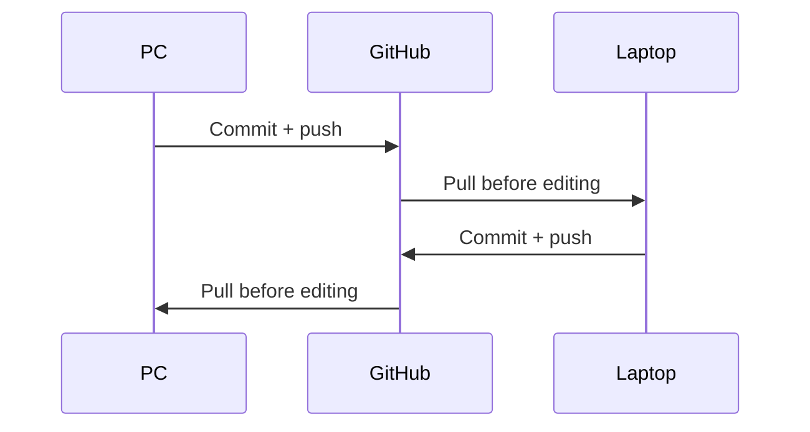

# Track 8 — Maintenance

**Goal:** Keep the portfolio trustworthy and healthy after launch without turning
maintenance into a second job.

## Normal PC ↔ laptop workflow

Use GitHub as the synchronization layer.



Do **not** sync the Git repository itself with Syncthing. Two independent systems
changing `.git` is a corruption/conflict risk.

Syncthing may be useful for large raw source assets kept outside Git, such as
uncompressed video/renders/reference exports.

## Before moving machines

On the machine you are leaving:

**GitHub Desktop:**

1. Inspect changes.
2. Finish the coherent task.
3. Run the relevant checks.
4. Commit.
5. Push.
6. Confirm no uncommitted work remains for the simple handoff.

On the next machine:

1. Open GitHub Desktop.
2. Fetch/pull.
3. Confirm branch + latest commit.
4. Only then open Antigravity/Claude and continue.

Use the [PC → laptop handoff prompt](../prompts/support-and-recovery.md) for a
meaningful in-progress milestone.

## Weekly — 10–20 minute operational check

- [ ] Review new enquiries/spam.
- [ ] Confirm forms still work using synthetic data if there was a release.
- [ ] Check recent production errors after changes.
- [ ] Check current branch/working copies are clean/pushed.
- [ ] Record only meaningful known issues.

## Monthly — engineering health

- [ ] Pull latest `main`.
- [ ] Create a maintenance branch.
- [ ] Review dependency/security updates; do not auto-major-upgrade everything.
- [ ] Run `npm run verify`.
- [ ] Review Search Console / analytics / Core Web Vitals.
- [ ] Check 404s/broken routes.
- [ ] Test owner sign-in/recovery.
- [ ] Test one complete synthetic enquiry.
- [ ] Review stale access/secrets.
- [ ] Export/backup data according to the approved production process.

## Quarterly — truth and product review

- [ ] Are Studio/Systems offers still accurate?
- [ ] Are any portfolio claims outdated?
- [ ] Can temporary visual assets be replaced with better real proof?
- [ ] Are privacy/terms/warranty versions still appropriate?
- [ ] Are free-tier/hosting limits creating reliability risk?
- [ ] Is there evidence for adding a new service/search-intent page?
- [ ] Is there a repeated task worth automating with a hook, MCP or Hermes-style workflow?

## Model/provider maintenance

Do not change the primary workflow every time a new model trends.

Change routing when:

- a current model becomes unavailable/unreliable;
- a new model repeatedly wins a real portfolio benchmark;
- cost/quota changes materially affect work;
- a harness adds a feature that removes a real burden.

See [Models + routing](../reference/models-and-routing.md).

## OpenCode + OmniRoute support path

Use [OpenCode + OmniRoute](../reference/opencode-and-omniroute.md) for:

- docs updates;
- cheap independent reviews;
- testing prompts;
- support during AgentRouter capacity issues;
- benchmarking current free models.

Keep primary implementation consistent unless a support model has actually
earned promotion.

## When to automate

Automate **repeated deterministic work**.

Good candidates:

- scheduled dependency/security reminder;
- periodic availability check;
- link/guide verification;
- release checklist reminders.

Bad candidates:

- autonomous production redesign;
- “improve site every night”;
- automatic deployment after arbitrary agent edits.

## When the site needs a new feature

Go back to
[Track 4 — Design and build loop](04-design-and-build-loop.md).

Maintenance does not bypass planning/verification just because the site is live.

## You have finished the guide

At this point the normal loop is:

```text
Need/idea
→ define one outcome
→ plan
→ critique
→ implement
→ verify
→ review
→ visual QA
→ commit
→ deploy only at a release gate
→ maintain
```

Keep the [README dashboard](../README.md) as your reset point whenever you feel
lost.

## Next

→ [README — Start Here](../README.md)
