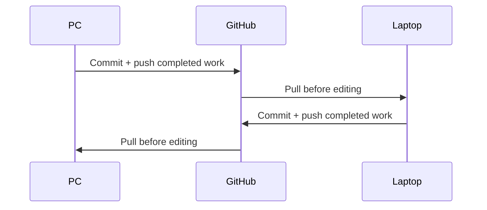

# Track 8 — Maintenance, PC ↔ laptop, recovery and support tools

**Goal:** Keep the portfolio healthy after launch and move between your PC and
laptop without losing work.

This is not a new build process. When a new feature is needed, go back to
[Track 4](04-design-and-build-loop.md).

---

# 1. Normal PC ↔ laptop workflow

Use GitHub as the synchronization layer.



Do **not** Syncthing the Git repository itself.

Syncthing is acceptable for large raw assets kept outside Git, such as:
uncompressed video, source renders, PSDs, original frame sequences or reference
exports.

## Before leaving one machine

**GitHub Desktop**

1. Review **Changes**.
2. Finish the coherent task or create a clear handoff.
3. Run the relevant checks.
4. Commit.
5. Push.
6. Confirm whether the working tree is clean.

## On the next machine

1. Open GitHub Desktop.
2. Select the portfolio repo.
3. Fetch.
4. Pull.
5. Confirm branch and latest commit.
6. Only then open that repo in Antigravity/Claude.

### If the task is mid-milestone, create a handoff before switching machines

**Use:** current primary writer or OpenCode docs agent.

### Paste this prompt

```text
Create a PC → laptop handoff for the current portfolio task.

DO NOT change application code unless a documentation update is required.

Record:
- IST timestamp
- UTC timestamp
- current branch
- latest commit SHA
- whether working tree is clean
- current task/outcome
- completed work
- files changed
- tests/checks already run
- current failures/known issues
- exact next action
- exact tool/model that should continue
- exact files/context the next agent should read first
- any local-only uncommitted state I must manually move/finish

Do not include secrets or customer data.
Keep it concise enough to read before resuming.
```

### What you check yourself

Do not switch machines if you have important uncommitted edits unless you fully
understand how they are being moved.

### Pass to the next tool

On the next machine, give the handoff to the model that is named in **exact next
action**.

---

# 2. Resume after switching machines

**Open:** same branch in GitHub Desktop + Antigravity.  
**Use:** the handoff's named model.  
**Give it:** handoff + source-of-truth docs + current branch diff/state.

### Paste this prompt

```text
Resume this mmoptibuilds task from the attached handoff.

FIRST
- read the handoff
- read README.md and AGENTS.md
- inspect git status/log/diff
- read the relevant source-of-truth files
- verify the branch/commit matches the handoff

DO NOT edit until you confirm the repository state matches the handoff.

RETURN FIRST:
1. branch/commit you see
2. whether the working tree matches the handoff
3. what is already done
4. exact next action

Only after state is confirmed should implementation continue.
```

### What you check yourself

Branch + commit must match what you pushed from the other machine.

### Pass to the next tool

If state matches, continue with the named model. If not, stop and reconcile Git
state before editing.

---

# 3. End every meaningful work session with docs

The next agent should not need your memory or an old chat.

Use this after meaningful coding/design/backend/release work.

### Paste this prompt

```text
Update the project handoff/source-of-truth for this session.

DO NOT create documentation bureaucracy.
Update only files genuinely affected.

CHECK WHETHER TO UPDATE
- docs/PROJECT-STATE.md → current factual state
- docs/ROADMAP.md → only if milestone/priority changed
- CHANGELOG.md → only for meaningful/user-visible change
- DESIGN.md → only if an approved design rule changed
- docs/DECISIONS.md → only for a real decision with tradeoff
- docs/agent-log/YYYY-MM.md → meaningful session handoff

AGENT LOG ENTRY
- IST time
- UTC time
- machine
- harness
- model
- role
- task
- files changed
- tests/commands + result
- browser/visual QA
- decisions
- known issues
- exact next action
- commit SHA or "not committed"

Keep entries concise.
Do not copy the whole conversation.
Do not include secrets/customer data.
```

### What you check yourself

The docs must answer “what is true now?” and “what should happen next?”

### Pass to the next tool

The next tool named in the handoff receives only the concise current-state docs
and task-relevant context.

---

# 4. OpenCode + OmniRoute support path

Use OpenCode only when it reduces cost/time or gives an independent opinion.

**Open:** a separate terminal in the same portfolio repo.  
**Important:** do not let OpenCode write while DeepSeek is writing the same
working tree.

Normal uses:

- Markdown/docs;
- read-only review;
- test ideas;
- simple isolated utility task;
- free-model benchmark;
- support when AgentRouter is unavailable.

Read [OpenCode + OmniRoute](../reference/opencode-and-omniroute.md) for install
and provider setup.

## Docs-only OpenCode prompt

**Use:** your docs agent / reliable free model.  
**Give it:** current diff + only affected docs.

### Paste this prompt

```text
You are a documentation-only assistant for mmoptibuilds.

ALLOWED
- read repository
- edit Markdown documentation only

NOT ALLOWED
- edit application code
- install dependencies
- deploy
- access secrets/customer data

TASK
Review the current code/task diff and update only documentation that became
factually stale.

Prefer:
- PROJECT-STATE
- agent log
- CHANGELOG when user-visible
- ROADMAP only when milestone state changed

Do not duplicate information.
Do not turn docs into a transcript.

Return:
files changed
why each changed
anything you deliberately did not update
```

### What you check yourself

GitHub Desktop should show only expected Markdown files.

### Pass to the next tool

If application changes are needed, stop OpenCode's docs writer and return to the
normal GLM → DeepSeek flow.

---

# 5. Benchmark a free model before trusting it with real implementation

Do not promote a model because a benchmark leaderboard or X post says it is
good.

Pick a **small real portfolio task** with a known answer.

Examples:

- review one diff;
- explain one test failure;
- propose tests for one component;
- create one docs-only patch;
- implement a tiny isolated utility in a disposable branch.

Run the same task with:

```text
primary trusted model
vs
candidate free model
```

### Paste this benchmark prompt into both

```text
BENCHMARK TASK
<PASTE THE SAME SMALL REAL TASK>

CONTEXT
Give both models the same exact files and instructions.

RULES
- do not broaden scope
- no dependency installs
- no deployment
- run/describe the same verification
- report uncertainty instead of guessing

RETURN
- approach
- result
- files changed if allowed
- verification
- unresolved issues
```

### What you check yourself

Score:

```text
correctness
instruction following
repo awareness
test quality
unnecessary edits
latency
stability
cost/quota
```

Only promote the free model when it repeatedly wins or is clearly good enough
for the assigned role.

### Pass to the next tool

If promoted, document the new model role in your model-routing/source-of-truth
doc before using it for important tasks.

---

# 6. Weekly maintenance — small, not bureaucratic

Do this after launch or after meaningful releases.

**Use:** OpenCode/cheap model or GLM read-only.

### Paste this prompt

```text
Perform the weekly mmoptibuilds maintenance review.

READ ONLY.

Check:
- recent known issues/project state
- recent releases
- forms/admin synthetic smoke-test notes
- production errors I provide
- spam/abuse patterns I summarize
- outstanding high-priority items

Do not propose a redesign.
Do not auto-upgrade dependencies.

Return:
1. urgent
2. this week
3. can wait
4. no action

Keep the total list small.
```

### What you check yourself

Maintenance should not create work just to look busy.

### Pass to the next tool

Any real code task → Track 4. Docs-only task → OpenCode docs agent.

---

# 7. Monthly engineering health

Create a maintenance branch first.

Run:

```powershell
npm run verify
npm audit
```

Review Search Console/analytics/Core Web Vitals manually.

### Paste this prompt

```text
Perform a monthly engineering-health review of mmoptibuilds.

READ ONLY.

INPUT
- npm run verify result
- npm audit result
- Search Console summary I provide
- Core Web Vitals/analytics summary I provide
- recent project state/changelog
- current package.json

CHECK
- real dependency/security issues
- broken/404 routes
- performance regressions
- SEO/indexing regressions
- stale content/proof
- owner auth/recovery status
- one synthetic enquiry flow
- stale access/secrets
- backup/export status

DO NOT
- mass-upgrade packages
- invent traffic conclusions
- propose visual redesign without evidence

RETURN
BLOCKER
THIS MONTH
WATCH
NO ACTION
```

### What you check yourself

Only create implementation branches for evidence-backed work.

### Pass to the next tool

Confirmed task → Track 4 planning flow.

---

# 8. Quarterly product/truth review

### Paste this prompt

```text
Perform a quarterly mmoptibuilds product/truth review.

READ
- PROJECT-BRIEF
- PROJECT-STATE
- ROADMAP
- current public content
- case-study evidence/status
- service definitions
- current known infrastructure limits I provide

CHECK
- are Studio offers still accurate?
- are Systems offers/boundaries still accurate?
- any outdated portfolio claims?
- any temporary/generated visual that should be replaced?
- any legal/privacy/warranty statement needing human/professional review?
- any service/search-intent page now justified by real evidence?
- any repeated manual task worth automating?
- any free-tier limit now creating reliability risk?

Do not invent evidence.
Return the smallest useful set of decisions/questions.
```

### What you check yourself

Quarterly review is for truth and direction, not obligatory churn.

### Pass to the next tool

Approved new feature/service work → Track 4. Professional/legal questions stay
with the appropriate human professional.

---

# 9. Recovery — failed build after an agent edit

Do not immediately reset or delete work.

**Use:** GLM-5.3 read-only first.  
**Give it:** exact failure + current diff + last known-good commit.

### Paste this prompt

```text
Diagnose a regression after the latest portfolio changes.

DO NOT edit yet.
DO NOT reset --hard.
DO NOT delete uncommitted work.

INPUT
- exact failing command/output
- git status
- git diff
- last known-good commit SHA
- task brief
- README.md / AGENTS.md

RETURN
1. likely task-caused vs environment-caused
2. exact evidence
3. smallest recovery option
4. whether a targeted code fix is safer than reverting
5. exact verification after recovery

Prefer preserving good work.
```

### What you check yourself

Do not run destructive Git commands you do not understand.

### Pass to the next tool

Accepted safe fix → DeepSeek. If revert is truly needed, use GitHub Desktop or
the Git reference page deliberately.

---

# 10. Recovery — an agent changed too much

**Use:** GLM read-only.

### Paste this prompt

```text
Review the current diff for scope creep.

TASK BRIEF
<PASTE ORIGINAL BRIEF>

Do not edit.

Classify each changed file:
REQUIRED
JUSTIFIED SUPPORTING CHANGE
UNRELATED / SCOPE CREEP
POTENTIALLY DANGEROUS

For every non-required file, explain the safest way to restore only that
unwanted change without discarding valid work.

Do not recommend git reset --hard.
```

### What you check yourself

Use GitHub Desktop's per-file/per-hunk review where possible.

### Pass to the next tool

Restore only unwanted scope, then return to the normal review/verify steps.

---

# 11. Recovery — provider/model outage

If AgentRouter/GLM/DeepSeek is temporarily unavailable:

1. do not rewrite the whole workflow;
2. save current branch/state;
3. use OpenCode/OmniRoute for docs/read-only work;
4. use Antigravity/Gemini for visual/research tasks;
5. resume primary coding when trusted writer access returns.

### Paste this prompt into a fallback reviewer

```text
PRIMARY PROVIDER IS TEMPORARILY UNAVAILABLE.

You are a SUPPORT-ONLY reviewer.

Allowed:
- read-only repository analysis
- docs suggestions
- test ideas
- explain failures

Not allowed:
- large application rewrite
- dependency changes
- deployment
- architecture migration

TASK
<PASTE SMALL SUPPORT TASK>

Return a bounded answer that can be handed back to the primary workflow later.
```

### What you check yourself

Do not let a temporary outage permanently change the architecture without a real
benchmark/decision.

### Pass to the next tool

When primary access returns, give the support findings to GLM for verification.

---

# 12. Recovery — secret accidentally exposed

If a real API key/secret is pasted into a chat, commit, screenshot or public
place:

1. treat it as compromised;
2. rotate/revoke it at the provider;
3. remove it from the current files/history using the safest appropriate
   procedure;
4. verify the new secret only exists in managed environment storage;
5. inspect logs/usage if the provider supports it.

Do not ask AI to repeat the secret back to you.

### Paste this prompt only after redacting the secret

```text
A credential was accidentally exposed.

THE ACTUAL SECRET IS REDACTED.

Help me create a recovery checklist for this repository/provider.

Need:
- rotate/revoke step
- places in repo/history/logs to inspect
- safest removal approach
- tests after replacement
- whether deployed environments need updating
- documentation/incident note without secret value

Do not request the secret.
Do not print example live-looking credentials.
```

### What you check yourself

Rotation at the provider is more important than merely deleting the visible
string from a file.

### Pass to the next tool

After rotation, give only redacted status to the normal security/release review.

---

# 13. When to use hooks, MCP, subagents or Hermes later

Automate only a repeated real burden.

Good:

- deterministic guide/link check;
- scheduled maintenance reminder;
- read-only database inspection;
- large test-output summarization;
- independent research;
- post-launch monitoring workflow.

Bad:

- autonomous nightly redesign;
- multiple agents rewriting the same files;
- automatic production deploy;
- dozens of MCP servers “just in case.”

Use [Subagents, MCP + hooks](../reference/subagents-mcp-and-hooks.md).

Hermes remains optional for repeated maintenance/research workflows after a real
need appears.

---

# 14. When the site needs a new feature

Return to:

→ [Track 4 — The exact design + build loop](04-design-and-build-loop.md)

Do not skip planning/verification because the site is already live.

## Final operating loop

```text
Need or evidence
→ define one outcome
→ GLM plan
→ Gemini critique
→ GLM reconcile
→ DeepSeek implement
→ targeted checks + verify
→ GLM code review
→ DeepSeek fix
→ Antigravity visual/browser QA
→ DeepSeek fix
→ final verify
→ docs/handoff
→ commit/push
→ deploy only at release gate
→ maintain
```

## Done when

- [ ] you can safely move work PC ↔ laptop through GitHub;
- [ ] every meaningful session leaves a usable handoff;
- [ ] OpenCode/free models stay scoped until benchmarked;
- [ ] maintenance is small and evidence-driven;
- [ ] you know how to recover from build/scope/provider/secret problems;
- [ ] new feature work returns to Track 4.

## Next

→ [README — Start Here](../README.md)
